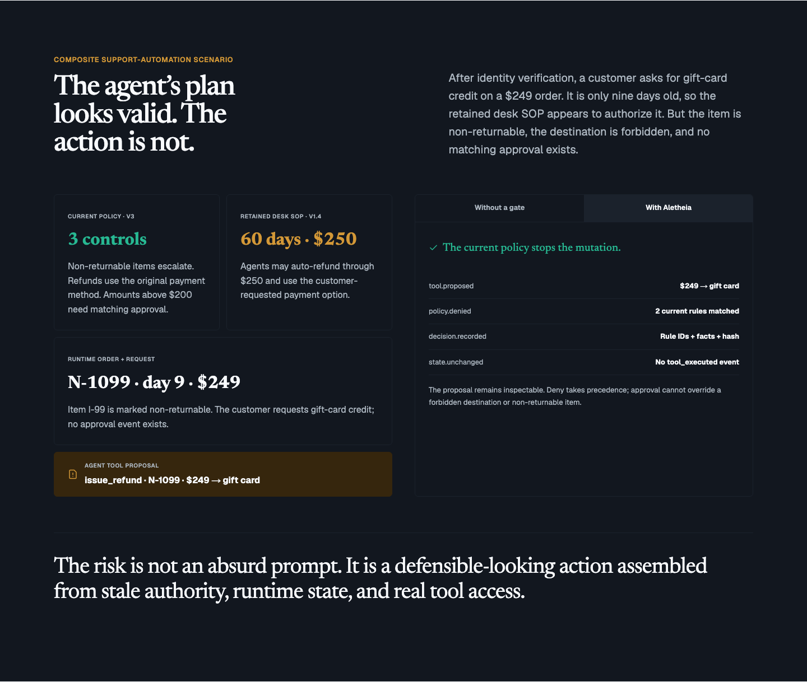

# Aletheia

**Source-aware policy refactoring and compilation for AI agents.**

[](https://github.com/amanda-yin-x/aletheia/actions/workflows/ci.yml)
[](docs/deployment.md)
[](LICENSE)

**Public site:** [aletheia.aletheia-web.workers.dev](https://aletheia.aletheia-web.workers.dev)

The public URL is the canonical Next.js site. Commit `147448a` is deployed as
the same bundle on the named staging Worker (version
`3788c6b0-291c-43a9-bef3-b48aaa4a0498`) and the canonical production Worker
(version `935c3c39-f63e-4041-804b-ef40431d50fc`). Public checks confirm `/` and
`/demo` return `200`, unauthenticated `/api/v1/me` returns `401`, HTTP redirects
to HTTPS with `308`, the current composite refund scenario and `ALETHEIA` brand
are served, and the real Turnstile challenge reaches its waiting state. An
automated browser was challenged, so Turnstile token redemption and the
complete anonymous hosted workflow are not yet claimed as verified. The
permanent-user Northstar lifecycle was previously verified on staging; see
[the deployment runbook](docs/deployment.md) for the exact boundary.

Aletheia refactors reviewed prompts, skills, policies, SOPs, and tool schemas
into a smaller always-loaded prompt kernel plus scoped skills, knowledge,
deterministic guards, tests, and explicit pending material. Exact source
anchors, placement decisions, generated spans, and pinned inputs make each
candidate build inspectable. The included Northstar Retail project starts with
a composite `$249` case where
order state, refund destination, approval policy, and a retained SOP disagree.
The workspace then provides a concrete path through the product: resolve two
policy conflicts, approve a strict refund boundary, compile a stored,
content-digested artifact bundle, compare labelled execution arms, inspect a
blocked `$200.01` boundary trace, and export Markdown or JSON evidence.


> Aletheia refactors reviewed agent instructions into a smaller always-loaded
> prompt kernel plus scoped skills, knowledge, guards, tests, and explicit
> pending material, with source-linked build evidence.

Aletheia is not a generic prompt compressor, production agent firewall, formal
verification system, compliance certification, or claim about live-model
performance. The bundled records are generated evaluation data; no customer
records or real business side effects are included.

| Product track | Current status |
|---|---|
| Gate 0 — local deterministic Northstar foundation | Complete in the settled tested fixture scope. |
| Gate 0H — hosted preview and hardening | In progress: permanent-user staging passed; anonymous Turnstile redemption and complete guest E2E remain unverified. |
| Gate 1 — source-aware generic compiler | Complete in the verified local two-domain fixture scope. This is not deployed/hosted Gate 1 evidence. |
| Gates 2–8 | Not implemented. Provider interfaces, tau data sync, schemas, or research notes do not make these operating capabilities. |

Gate 1 is local working-tree status, not deployed status. The public Workers
still serve the separately identified `147448a` bundle until a later verified
promotion.

## Why policy CI

Agent instructions rarely live in one clean prompt. In the landing scenario, a
verified customer requests gift-card credit for order `N-1099`: `$249`, nine
days after delivery, but marked non-returnable. A retained SOP appears to allow
the action because it permits 60-day returns, automatic refunds through `$250`,
and the customer-requested destination. Current policy instead requires an
escalation, the original payment method, and matching approval above `$200`.

Northstar makes the entire failure path inspectable. In the unenforced arm, the
policy decision is recorded but the proposed refund still mutates state. In the
guarded arm, destination and returnability rules deny the exact call before
execution; rule IDs, evaluated facts, a decision hash, and unchanged state are
retained. The separate `$200.01` case verifies the strict approval boundary.



## Quick start

Requirements: Python 3.12+, `uv`, Node 22 LTS, and Corepack. The local fixture
path needs no Supabase project, model API key, or Docker.

```bash
make bootstrap
make demo
```

Open [http://localhost:3000](http://localhost:3000). The API and local OpenAPI
UI are available at [http://localhost:8000](http://localhost:8000) and
[http://localhost:8000/docs](http://localhost:8000/docs).

Local and hosted modes are separated, and production fails closed:

- the API itself defaults to `ENVIRONMENT=production`; local commands
  explicitly select `ENVIRONMENT=local` and a fixed development identity;
- explicit `AUTH_MODE=local` is accepted only on a loopback `SITE_URL`;
- `make demo` also has a development-only fallback when Supabase configuration
  is absent; that fallback cannot activate in a production build;
- SQLite is the zero-install database;
- the deterministic fixture runner does not call a model;
- the API refuses to start with incomplete production Postgres/TLS, Supabase,
  web-origin, or origin-secret settings; and
- the production web path disables local auth, rejects incomplete
  Supabase/Turnstile configuration, and will not proxy without an HTTPS API
  origin and server-only origin credential.

Docker Compose is an alternative local PostgreSQL stack:

```bash
docker compose up --build
```

The Compose configuration includes PostgreSQL, FastAPI, a worker, and the
Next.js server. It is configuration-complete, but a clean-image smoke test is
still a release gate in this repository snapshot.

## Product walkthrough

1. Open **Northstar Retail Refund Agent** and go to **Rules**.
2. Review the source-linked 30/60-day and `$200`/`$250` conflicts plus the
   unresolved “daylight hours” ambiguity.
3. Resolve the critical conflicts in favour of Refund Policy v3. Open
   **Approval above $200**, inspect the exact quote and
   `amount.minor_units > 20000`
   condition, then approve the revision.
4. Choose explicit destinations for the reviewed clauses, then open **Build**
   and compile a candidate. The Gate 1 artifact contract includes a prompt
   kernel, scoped `SKILL.md`, knowledge, pre-tool policy, regression YAML,
   unsupported-material ledger, routing/preservation/metric reports, exact
   source map, pinned inputs, and manifest. The concrete build manifest is
   authoritative for the exact artifact set.
5. Open **Tests**, run the bundled release suite, and inspect the
   `$200.01 without approval` guarded trace. The proposal is recorded, approval
   is required, and no refund mutation occurs.
6. Inspect each rule-derived generated span back to its rule revision,
   placement version, and exact source anchor. Then create an evidence report
   and download Markdown or canonical JSON.

The verified local Gate 1 implementation includes an Acme appointments domain pack to
test the same compiler outside refunds. It is synthetic evaluation data, not a
live scheduling integration. The confirmed local Gate 1 suite exercises it
through the shared compiler/runner; browser/release-bundle checks still gate
the final status.

The exact 90-second talk track is in [docs/demo-script.md](docs/demo-script.md).

## Hosted architecture

```text
public browser
    │
    ├── GET / ───────────────────────────────► public Cloudflare landing page
    │
    └── GET /demo ───────────────────────────► public guest entry
          │
          ▼
    Turnstile ─► Supabase anonymous sign-in
          │ signed session: role=authenticated, is_anonymous=true
          ▼
    Next.js 16 + OpenNext on Cloudflare Workers
          │ same-origin /api/v1/* proxy
          │ Authorization: Bearer <Supabase JWT>
          │ X-Aletheia-Origin-Token: <server-only shared secret>
          ▼
    Render FastAPI service
          │ verifies origin token + JWT, then applies workspace membership scope
          ▼
    Supabase Postgres
```

The browser never receives `API_ORIGIN_URL`, `API_ORIGIN_TOKEN`, a database
connection string, a Supabase service-role key, or OAuth provider secrets. All
product API requests use the Cloudflare app's same-origin proxy. Mutations also
require an exact `Origin` match and a double-submit CSRF token.

The auth callback accepts only a browser-bound Supabase PKCE authorization
`code`; portable raw `token_hash` links are rejected. At the Render boundary,
production requests must first carry the shared origin credential and a bearer
token. Hosted document-upload requests are then rejected before FastAPI routes
or multipart body parsing run; secure customer ingestion is not implemented.

Each signed Supabase subject—anonymous guest or permanent account—receives an
idempotently bootstrapped personal workspace and Northstar project. Backend
reads and writes join through `workspace_members`; unauthorized cross-tenant
resource IDs return not found. A guest can exercise the seeded review,
build/run, trace, and report workflow without supplying an email address. A
guest can later attach a new email identity in place, preserving the same
Supabase subject and workspace; manual identity linking is enabled for the
equivalent future OAuth upgrade path. Guest workspaces intentionally disable
uploads, arbitrary project creation, and
reset; allow at most 30 successful writes and six live operations; and expire
after seven days. Cleanup targets anonymous identities older than 30 days at
startup and every 24 hours. In hosted Postgres, guest age is anchored to
`auth.users.created_at`, and cleanup also removes old anonymous Auth identities
that never created an application account/workspace.

The hosted proxy configures per-subject Cloudflare thresholds of 120 general,
90 polling, and 30 heavy requests per minute. Cloudflare evaluates these
per-location with permissive, eventually consistent counters; they are abuse
controls, not an exact global quota. Mutation bodies are capped at 64 KiB at
both the Worker and FastAPI boundaries. The 85-second bound applies until the
Worker receives upstream response headers; it does not time a streamed body
after headers arrive.

Supabase's native CAPTCHA integration verifies that Turnstile succeeded, but it
does not separately enforce Turnstile's returned `action` or `hostname` fields.
The `guest_demo`, `waitlist`, and `login` actions are client-side labels. The
widget allowlist contains only the canonical and staging hostnames; local
development uses local auth or Cloudflare's Turnstile test key.

The waitlist accepts a normalized, unique email through the authenticated API
for either a guest or permanent session. Its consent record remains after guest
workspace cleanup; submitting an email does not silently convert the anonymous
account into a permanent account. The role model contains owner, admin, editor,
and viewer scopes, although team invitations and role-management UI are not
built yet.

Builds and runs use a durable operation contract. Their `POST` endpoints return
HTTP `202`, a `Location` header, and `OperationOut`. The web app polls
`GET /api/v1/jobs/{id}`, handles success and every modeled failure state, then
loads and navigates to only the validated `resource_type` and `resource_id`.

Read [docs/hosted-workspace.md](docs/hosted-workspace.md) for the complete
human-readable implementation inventory and
[docs/capabilities.json](docs/capabilities.json) for the machine-readable status.

## Architecture inside the API

```text
raw source bytes → versioned documents + authority metadata + exact anchors
    → reviewed Rule IR → append-only placement decisions + pinned profile
    → deterministic compiler → prompt kernel / skill / knowledge / guard / tests
    → generated spans / routing / preservation / metrics / source map
    → deterministic replay → pre-tool policy decision → covered tools
    → labelled-arm results → traces / metrics → evidence report

                         ┌ Typer CLI
domain services + SQL ───┼ FastAPI / SQL operation worker
                         └ Next.js same-origin client
```

The backend remains a modular monolith. Generic compilation is profile-driven;
Northstar and Acme content belongs in domain packs/seed services rather than
compiler branches. Core policy, compiler, and runner
modules do not import FastAPI; HTTP routes and the Typer CLI call the same async
services. SQLite in WAL mode is the local default, while Alembic and the same
SQLAlchemy models support PostgreSQL.

## Commands

```bash
make bootstrap                 # locked install, migrate, seed, export contracts
make demo                      # local API :8000 + web :3000
make test                      # backend + frontend unit suites
make ci                        # lint, typing, tests, OpenNext build, Wrangler dry run

cd apps/api
uv run aletheia analyze --project northstar-retail --extractor fixture
uv run aletheia compile --project northstar-retail
uv run aletheia test --project northstar-retail --adapter fixture --arms all
uv run aletheia report --latest --format markdown
uv run aletheia worker --once
```

A fresh seed intentionally blocks compilation. Resolve the two critical
current-vs-legacy findings and approve the threshold before compiling. That is
the product's human review gate, not a setup failure.

## Deterministic and optional live modes

The `fixture` runner is deterministic and never calls a model. It is the only
execution path used by the bundled tests. Provider protocols and explicit
failure stubs exist, but an OpenAI-compatible live tool loop is not implemented
and no live result is claimed.

The optional tau2 Retail sync is provenance-checked:

```bash
make benchmark-sync
```

It targets `sierra-research/tau2-bench` tag `v1.0.1`, verifies the reviewed
commit prefix, and records selected paths, hashes, licence, and task IDs. Sync
is optional and does not execute or score the benchmark.

## Verification boundary

Gate 1 is complete in the verified local two-domain fixture scope. Final local
results are: 139 passed and one skipped in the default API suite; 31 passed in
the focused regenerated-contract/Gate 1 suite; Ruff and mypy passed; SQLite
Alembic upgrade/drift passed through `0006`; and a fresh real-PostgreSQL
migration integration passed one test with four deselected before its temporary
database was removed. The frontend passed ESLint, strict type checking, all 84
Vitest tests across 22 files, and a production Next.js build including the
dynamic Placements route. The OpenNext bundle passed at compatibility date
`2026-08-04`; Wrangler `4.118.0` type generation, root/staging deploy dry-runs,
and startup check passed. The dry-runs packaged 53 assets and an 8,019.91 KiB
bundle (1,665.20 KiB gzip); local active startup measured 34.0 ms. These are
packaging checks, not deployment or production-performance evidence. None of
these local results changes the deployed `147448a` Worker claim.

The focused two-domain browser flow passed 1/1 in 15.2 seconds. The complete
Playwright suite passed 6/6 in 1.3 minutes using fresh isolated API/web ports and
Next output. The earlier transient 404 reproduced only with stale reused Next
development output and disappeared on the clean run; no product workaround was
added. `pip-audit` and the production high-severity `pnpm audit` reported no
known vulnerabilities.

The counts below describe the settled pre-Gate-1/public-guest release and must
not be read as verification of Gate 1 implementation commit `d10af278`.

The hosted changes have automated coverage for JWT validation,
tenant scoping, operation idempotency and lease recovery, migrations, CSRF and
Origin checks, the code-only PKCE callback, pre-routing hosted upload rejection,
session-cookie refresh, Turnstile token reuse prevention, operation polling,
strict Draft 2020-12 tool schemas, exact USD minor-unit fixtures,
build/evidence contracts, strict TypeScript, the Next.js production build, the
OpenNext Cloudflare bundle, and a five-flow local Playwright suite. In the
current public-guest release, all 71 web unit/component tests pass across 18
files.
All 116 backend tests pass across two local runs: 115 in the default run and one
PostgreSQL-marked integration test in the real PostgreSQL run. The five browser
flows also pass locally. The same bundle is now deployed on staging and
production, where public routing, current content, the unauthenticated API
boundary, and Turnstile rendering have been checked. Token redemption and the
complete anonymous flow remain unverified on hosted infrastructure. A real
local PostgreSQL 14 run also passed the empty-database migration,
Supabase-named role
privilege denial, bootstrap, queued build/run worker, polling, and downgrade
path. A real two-session PostgreSQL test also proves that snapshot-consuming
operations and child-row mutations take locks in the same `Project → child`
order, so a mutation cannot cross the captured-input fence.

The verified Gate 1 backend, web, build, Worker dry-run, and clean six-flow
browser checks all passed locally. The repository's quality, secret-scan, and
PostgreSQL integration jobs also passed in [GitHub Actions run
#30963519448](https://github.com/amanda-yin-x/aletheia/actions/runs/30963519448)
on documentation checkpoint `25b42ff` and implementation parent `d10af27`.
The target Supabase project is migrated through Alembic head; its Data API is
disabled, `anon`/`authenticated` have no application-table privileges, and the
future-table default denial was verified transactionally. The Render service
and named Cloudflare staging Worker passed the permanent-user authenticated
bootstrap,
two-user isolation, build/run/trace/report, download, and direct-origin security
path. The new anonymous-guest path, limits, expiry/cleanup, reset denial, and
waitlist persistence have not yet passed against the hosted stack. Deployment
of commit `147448a` is therefore evidence of release parity and the recorded
public-edge checks, not a claim that the guest lifecycle or a production
reliability program has completed.

For approved, machine-decidable rules, the covered policy adapter can
deterministically allow, block, or request approval before a covered tool call
executes. This applies only to configured semantics and calls routed through
that adapter. Exact provenance and structural preservation checks establish
deterministic build conformance; `behavioral_fidelity` remains `not_measured`.
See [docs/evidence-boundary.md](docs/evidence-boundary.md).

## Deployment status

| Area | Status | Meaning |
|---|---|---|
| Public landing and guest entry | Deployed on staging and production; guest E2E pending | `/` and `/demo` return `200`; the current scenario and brand are served; the real Turnstile frame reaches `waiting`. Token redemption and anonymous bootstrap were not completed by the challenged automated browser. |
| Permanent-account auth and session refresh | Authenticated staging path verified with limits | Email magic link works for authorized project-team addresses. Manual OTP and GitHub remain disabled. |
| Same-origin API proxy | Deployed; authenticated staging path previously verified | The current release returns `401` for unauthenticated `/api/v1/me`. Streaming, bearer forwarding, Origin/CSRF enforcement, origin-secret injection, and report downloads previously passed through Cloudflare to Render with a permanent account; reverify with an anonymous JWT. |
| FastAPI JWT, origin authentication, and tenancy | Guest-capable API deployed and ready; anonymous path pending | Render deploy `dep-d9p481tbedkc73e3677g` completed, `/readyz` returns `200`, and the service accepts correctly signed anonymous JWTs with `role=authenticated` while retaining issuer/audience/signature checks and workspace isolation. A redeemed hosted anonymous token has not yet exercised that path. |
| Guest limits and retention | Implemented in source; hosted lifecycle verification pending | 30 successful writes, six live operations, no reset, seven-day access TTL, and 30-day cleanup at startup/every 24 hours with a dry-run CLI and fail-open alerts. |
| Edge/API request controls | Worker bundle deployed; complete hosted verification pending | Per-user 120 general/90 polling/30 heavy per-location thresholds, 64 KiB mutation bodies at both hops, and an 85-second response-header deadline. HTTP-to-HTTPS and the unauthenticated API boundary pass; the remaining Worker/API controls still need exercise. |
| Waitlist | Implemented in source; hosted submission verification pending | Normalized unique consent email behind the authenticated guest/permanent API; consent survives guest cleanup. |
| PostgreSQL migrations and operation lifecycle | Guest migration applied; anonymous lifecycle pending | Render startup logs record Alembic `0004 → 0005_guest_access_waitlist`, followed by successful application startup and readiness. The hosted Data API/grant boundary previously passed; the connected guest data lifecycle still needs end-to-end verification. |
| Cloudflare + Render + Supabase integration | Exact bundle deployed; guest E2E pending | Commit `147448a` is on staging version `3788c6b0-291c-43a9-bef3-b48aaa4a0498` and production version `935c3c39-f63e-4041-804b-ef40431d50fc`. The permanent-user lifecycle previously passed on staging; complete guest token redemption and workflow remain unverified. |

See [docs/deployment.md](docs/deployment.md) for the exact runbook.

## Current limitations

- Commit `147448a` is deployed on both named staging and canonical production.
  Public routes, current content, HTTPS redirect, the unauthenticated API
  boundary, and Turnstile rendering are verified. Automated testing did not
  redeem a Turnstile token, so anonymous sign-in, bootstrap, and the complete
  guest workflow remain hosted-verification gaps. The permanent-user lifecycle
  was previously verified on staging.
- Email magic-link delivery currently uses Supabase's default SMTP and is
  limited to authorized project-team addresses. Custom SMTP is required before
  general sign-up; manual email OTP and GitHub OAuth are currently disabled.
- Render Free sleeps after idle periods and can take roughly a minute to wake.
  The bounded “Waking your workspace…” recovery UI improves the demo path but
  is not an availability guarantee.
- The verified local Gate 1 implementation supplies a generic compiler/profile and a second
  Acme appointments corpus. Fixture findings, seeded reviews, and replay
  trajectories remain domain-specific evaluation code; arbitrary extraction,
  general conflict analysis, temporal monitoring, and live integrations do not
  exist.
- Compilation reports structural routing, exact provenance, protected-literal
  checks, and declared linkage. It does not measure semantic equivalence or
  behavioral fidelity, and it does not prove that a smaller kernel improves
  model quality or cost.
- Runs verify the selected build root and load its stored policy, test
  specifications/trajectories, tool registry, and fact metadata. A live test row
  remains only as relational identity; run, trace, and report presentation uses
  the stored result snapshot.
- The settled backend suite reproduces equivalent build roots byte-for-byte,
  and the repository CI passed on the settled implementation commit. Bundles
  remain unsigned database records rather than signed objects in an append-only
  release store.
- Tenant authorization is enforced in FastAPI query scopes; Postgres RLS is not
  defined. On the hosted Supabase target, the Data API is disabled,
  `anon`/`authenticated` hold no application-table privileges, and a
  transactionally created probe table inherited the expected default denial.
  RLS or a private-schema/least-privilege server role remains the stronger next
  boundary before broader customer data or team functionality.
- The hosted Render blueprint uses inline operations on a Free web service. A
  separately deployed durable worker is not part of that free hosted topology.
- Guest workspaces are temporary and bounded: 30 successful writes, six live
  operations, no reset, seven-day access, and cleanup eligibility after 30
  days. They are for evaluating Northstar, not storing customer data.
- Hosted uploads and arbitrary project creation are disabled. The waitlist
  stores a normalized unique consent email separately so consent survives
  guest-workspace cleanup.
- Guest cleanup runs once during API startup and then every 24 hours; failures
  are alerted without taking readiness down. It also removes anonymous
  Supabase Auth identities older than 30 days that never bootstrapped an app
  account.
- No team invitation, role administration, approval inbox, audit-ledger,
  billing/plan administration, object-storage, artifact-signing,
  release-promotion, or customer runtime SDK exists yet.
- No OCR, URL ingestion, arbitrary policy code, or live-model tool loop exists.
- The fixture runner validates every proposed call against its build-pinned
  Draft 2020-12 tool schema before policy evaluation or execution, including
  types, required fields, nested schemas, and unexpected properties. Northstar
  money uses exact `{currency: "USD", minor_units}` values.
- The bounded interpreter supports tool/domain/lifecycle scope, fact and
  prior-event requirements, correlated approvals, exceptions,
  `not_applicable`, and fail-closed `indeterminate` results. It is still an
  in-memory fixture adapter: there is no typed fact catalog, multi-currency
  model, generic timezone/temporal monitor system, or customer runtime SDK.

## Documentation

- [Hosted workspace: built, verified, pending, and next](docs/hosted-workspace.md)
- [Current state and production roadmap](docs/current-state-and-production-roadmap.md)
- [Deployment and hosting runbook](docs/deployment.md)
- [Machine-readable capabilities](docs/capabilities.json)
- [Architecture](docs/architecture.md)
- [Evidence boundary](docs/evidence-boundary.md)
- [Design references and decisions](docs/design-references.md)
- [90-second walkthrough](docs/demo-script.md)
- [Build plan and gates](docs/build-plan.md)
- [Gate 1 local verification report](docs/gate-1-verification-report.md)
- [Independent product and engineering review v2](docs/aletheia_independent_review_and_product_decision_v2.md)
- [Repository continuation and Gate 1 handoff v3](docs/aletheia_refined_codex_execution_handoff_v3.md)
- [Research map v2 (80 retained sources)](docs/aletheia_research_map_80_sources_v2.md)

## License and acknowledgements

Aletheia is released under the [MIT License](LICENSE). Third-party data,
libraries, the project-scoped Hallmark skill, and research references are
documented in [THIRD_PARTY_NOTICES.md](THIRD_PARTY_NOTICES.md) and
[docs/design-references.md](docs/design-references.md).
