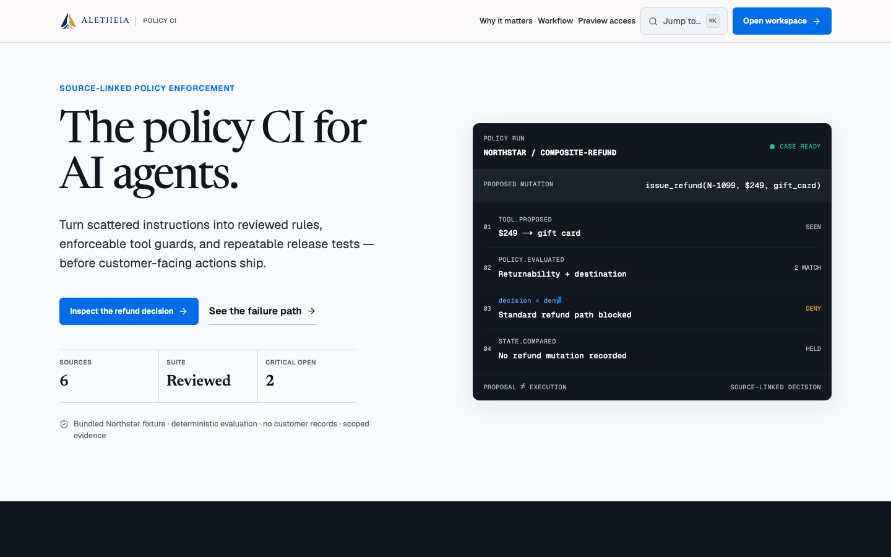

# Aletheia

**Policy CI for AI agents.**

[](https://github.com/amanda-yin-x/aletheia/actions/workflows/ci.yml)
[](docs/hosted-workspace.md)
[](LICENSE)

**Public site:** [aletheia.aletheia-web.workers.dev](https://aletheia.aletheia-web.workers.dev)

The public URL is the canonical Next.js site. The repository now contains the
authenticated hosted-workspace architecture, but the new Supabase and Render
integration has not yet been provisioned and verified end to end. The public
hostname may continue to serve an earlier landing-only release until that
deployment is completed.

Aletheia turns scattered agent instructions into source-linked rules, reviewed
release artifacts, deterministic tool guards, and repeatable release tests. The
included Northstar Retail project provides a concrete path through the product:
resolve two policy conflicts, approve a strict refund boundary, compile a
stored, content-digested artifact bundle, compare labelled execution arms,
inspect a blocked `$200.01` refund trace, and export Markdown or JSON evidence.



> Aletheia turns agent policies into reviewed prompt, guard, and regression-test
> artifacts, then shows how a candidate behaves across repeatable release
> scenarios.

Aletheia is not a generic prompt compressor, production agent firewall, formal
verification system, compliance certification, or claim about live-model
performance. The bundled records are generated evaluation data; no customer
records or real business side effects are included.

## Why policy CI

Agent instructions rarely live in one clean prompt. A current policy can say
30 days and approval above `$200` while a legacy SOP still says 60 days and
automatic refunds through `$250`. If both reach an agent as plain text, the
first visible failure can be a customer-facing side effect.

The Northstar scenario makes that failure mode inspectable. Aletheia exposes
the disagreement for review, compiles the selected boundary, and intercepts a
`$200.01` refund proposal before the covered operation changes state. The
proposal, decision, source rule, and unchanged state remain distinct evidence.

## Quick start

Requirements: Python 3.12+, `uv`, Node 22 LTS, and Corepack. The local fixture
path needs no Supabase project, model API key, or Docker.

```bash
make bootstrap
make demo
```

Open [http://localhost:3000](http://localhost:3000). The API and local OpenAPI
UI are available at [http://localhost:8000](http://localhost:8000) and
[http://localhost:8000/docs](http://localhost:8000/docs).

Local and hosted modes are separated, and production fails closed:

- the API itself defaults to `ENVIRONMENT=production`; local commands
  explicitly select `ENVIRONMENT=local` and a fixed development identity;
- explicit `AUTH_MODE=local` is accepted only on a loopback `SITE_URL`;
- `make demo` also has a development-only fallback when Supabase configuration
  is absent; that fallback cannot activate in a production build;
- SQLite is the zero-install database;
- the deterministic fixture runner does not call a model;
- the API refuses to start with incomplete production Postgres/TLS, Supabase,
  web-origin, or origin-secret settings; and
- the production web path disables local auth, rejects incomplete
  Supabase/Turnstile configuration, and will not proxy without an HTTPS API
  origin and server-only origin credential.

Docker Compose is an alternative local PostgreSQL stack:

```bash
docker compose up --build
```

The Compose configuration includes PostgreSQL, FastAPI, a worker, and the
Next.js server. It is configuration-complete, but a clean-image smoke test is
still a release gate in this repository snapshot.

## Product walkthrough

1. Open **Northstar Retail Refund Agent** and go to **Rules**.
2. Review the source-linked 30/60-day and `$200`/`$250` conflicts plus the
   unresolved “daylight hours” ambiguity.
3. Resolve the critical conflicts in favour of Refund Policy v3. Open
   **Approval above $200**, inspect the exact quote and
   `amount.minor_units > 20000`
   condition, then approve the revision.
4. Open **Build** and compile a candidate. The output contains the prompt
   kernel, refund workflow, tool policy, regression YAML, source map, and
   manifest.
5. Open **Tests**, run the bundled release suite, and inspect the
   `$200.01 without approval` guarded trace. The proposal is recorded, approval
   is required, and no refund mutation occurs.
6. Create an evidence report and download Markdown or canonical JSON.

The exact 90-second talk track is in [docs/demo-script.md](docs/demo-script.md).

## Hosted architecture

```text
public browser
    │
    ├── GET / ───────────────────────────────► public Cloudflare landing page
    │
    └── protected route
          │
          ▼
    Supabase Auth (email link/OTP or GitHub, Turnstile on email requests)
          │ session cookies refreshed before protected rendering
          ▼
    Next.js 16 + OpenNext on Cloudflare Workers
          │ same-origin /api/v1/* proxy
          │ Authorization: Bearer <Supabase JWT>
          │ X-Aletheia-Origin-Token: <server-only shared secret>
          ▼
    Render FastAPI service
          │ verifies origin token + JWT, then applies workspace membership scope
          ▼
    Supabase Postgres
```

The browser never receives `API_ORIGIN_URL`, `API_ORIGIN_TOKEN`, a database
connection string, a Supabase service-role key, or OAuth provider secrets. All
product API requests use the Cloudflare app's same-origin proxy. Mutations also
require an exact `Origin` match and a double-submit CSRF token.

The auth callback accepts only a browser-bound Supabase PKCE authorization
`code`; portable raw `token_hash` links are rejected. At the Render boundary,
production requests must first carry the shared origin credential and a bearer
token. Hosted document-upload requests are then rejected before FastAPI routes
or multipart body parsing run; secure customer ingestion is not implemented.

Each authenticated subject receives an idempotently bootstrapped personal
workspace and Northstar project. Backend reads and writes join through
`workspace_members`; unauthorized cross-tenant resource IDs return not found.
The role model contains owner, admin, editor, and viewer scopes, although team
invitations and role-management UI are not built yet.

Builds and runs use a durable operation contract. Their `POST` endpoints return
HTTP `202`, a `Location` header, and `OperationOut`. The web app polls
`GET /api/v1/jobs/{id}`, handles success and every modeled failure state, then
loads and navigates to only the validated `resource_type` and `resource_id`.

Read [docs/hosted-workspace.md](docs/hosted-workspace.md) for the complete
human-readable implementation inventory and
[docs/capabilities.json](docs/capabilities.json) for the machine-readable status.

## Architecture inside the API

```text
source files → versioned documents + exact spans → reviewed Rule IR
    → deterministic compiler → prompt / workflow / policy / tests / source map
    → deterministic replay → pre-tool policy decision → covered tools
    → labelled-arm results → traces / metrics → evidence report

                         ┌ Typer CLI
domain services + SQL ───┼ FastAPI / SQL operation worker
                         └ Next.js same-origin client
```

The backend remains a modular monolith. Core policy, compiler, and runner
modules do not import FastAPI; HTTP routes and the Typer CLI call the same async
services. SQLite in WAL mode is the local default, while Alembic and the same
SQLAlchemy models support PostgreSQL.

## Commands

```bash
make bootstrap                 # locked install, migrate, seed, export contracts
make demo                      # local API :8000 + web :3000
make test                      # backend + frontend unit suites
make ci                        # lint, typing, tests, OpenNext build, Wrangler dry run

cd apps/api
uv run aletheia analyze --project northstar-retail --extractor fixture
uv run aletheia compile --project northstar-retail
uv run aletheia test --project northstar-retail --adapter fixture --arms all
uv run aletheia report --latest --format markdown
uv run aletheia worker --once
```

A fresh seed intentionally blocks compilation. Resolve the two critical
current-vs-legacy findings and approve the threshold before compiling. That is
the product's human review gate, not a setup failure.

## Deterministic and optional live modes

The `fixture` runner is deterministic and never calls a model. It is the only
execution path used by the bundled tests. Provider protocols and explicit
failure stubs exist, but an OpenAI-compatible live tool loop is not implemented
and no live result is claimed.

The optional tau2 Retail sync is provenance-checked:

```bash
make benchmark-sync
```

It targets `sierra-research/tau2-bench` tag `v1.0.1`, verifies the reviewed
commit prefix, and records selected paths, hashes, licence, and task IDs. Sync
is optional and does not execute or score the benchmark.

## Verification boundary

The current hosted changes have local automated coverage for JWT validation,
tenant scoping, operation idempotency and lease recovery, migrations, CSRF and
Origin checks, the code-only PKCE callback, pre-routing hosted upload rejection,
session-cookie refresh, Turnstile token reuse prevention, operation polling,
strict Draft 2020-12 tool schemas, exact USD minor-unit fixtures,
build/evidence contracts, strict TypeScript, the Next.js production build, the
OpenNext Cloudflare bundle, and a five-flow local Playwright suite. The current
web unit/component suite passed all 32 tests across ten files. A real local
PostgreSQL 14 run also passed the empty-database migration, Supabase-named role
privilege denial, bootstrap, queued build/run worker, polling, and downgrade
path.

The settled backend, web, build, Worker dry-run, and clean five-flow browser
checks all passed locally. The repository's quality, secret-scan, and
PostgreSQL 17 jobs also passed in [GitHub Actions run
#30867243068](https://github.com/amanda-yin-x/aletheia/actions/runs/30867243068).
Clean Docker startup remains a separate release gate. Provisioned
Supabase/Render services, the hosted database migration, auth-provider flow,
cold-start behavior, and the cross-origin smoke test are pending hosted
verification. Do not interpret checked-in deployment configuration as proof
that those external services exist or have passed production testing.

For approved, machine-decidable rules, the covered policy adapter can
deterministically allow, block, or request approval before a covered tool call
executes. This applies only to configured semantics and calls routed through
that adapter. See [docs/evidence-boundary.md](docs/evidence-boundary.md).

## Deployment status

| Area | Status | Meaning |
|---|---|---|
| Public landing and product UI | Implemented; locally verified | Next.js and OpenNext builds pass locally. |
| Supabase SSR auth and session refresh | Implemented; locally verified | Code-only PKCE exchange, raw-token rejection, cookie refresh, and UI behavior are covered locally; external providers remain pending. |
| Same-origin API proxy | Implemented; locally verified | Streaming, bearer forwarding, Origin/CSRF, and origin-secret injection are checked in. |
| FastAPI JWT, origin authentication, and tenancy | Implemented; locally verified | The full backend suite passed, including the fail-closed boundary and hosted upload rejection before multipart parsing; external JWKS and two-user hosted checks remain pending. |
| PostgreSQL migrations and operation lifecycle | Implemented; locally and CI verified | A PostgreSQL 14 empty-database lifecycle and `anon`/`authenticated` privilege test passed locally, and the PostgreSQL 17 Actions job passed; target Supabase migration and Data API verification remain pending. |
| Cloudflare Worker configuration | Implemented; locally built | Production and named staging bindings are explicit and deployment preview URLs are disabled; neither current Worker revision is claimed deployed. |
| Cloudflare + Render + Supabase integration | Pending hosted verification | Runtime variables, secrets, OAuth, SMTP, Turnstile, deploys, and end-to-end smoke tests remain. |

See [docs/deployment.md](docs/deployment.md) for the exact runbook.

## Current limitations

- Hosted provisioning and production verification are not complete.
- The Northstar findings, compiler templates, and replay trajectories remain
  domain-specific evaluation code, not a general policy-analysis system.
- Runs verify the selected build root and load its stored policy, test
  specifications/trajectories, tool registry, and fact metadata. A live test row
  remains only as relational identity; run, trace, and report presentation uses
  the stored result snapshot.
- The settled backend suite reproduces equivalent build roots byte-for-byte,
  and the repository CI passed on the settled implementation commit. Bundles
  remain unsigned database records rather than signed objects in an append-only
  release store.
- Tenant authorization is enforced in FastAPI query scopes; Postgres RLS is not
  defined. The migration conditionally revokes current and default table
  privileges from Supabase's `anon` and `authenticated` roles, and that behavior
  passed against local PostgreSQL. The target Supabase grants and Data API have
  not been inspected, so the tables must remain unexposed until that denial is
  verified on the hosted database or a stronger RLS/private-schema boundary is
  established.
- The hosted Render blueprint uses inline operations on a Free web service. A
  separately deployed durable worker is not part of that free hosted topology.
- No team invitation, role administration, approval inbox, audit-ledger,
  billing, quota, object-storage, artifact-signing, release-promotion, or
  customer runtime SDK exists yet.
- No OCR, URL ingestion, arbitrary policy code, or live-model tool loop exists.
- The fixture runner validates every proposed call against its build-pinned
  Draft 2020-12 tool schema before policy evaluation or execution, including
  types, required fields, nested schemas, and unexpected properties. Northstar
  money uses exact `{currency: "USD", minor_units}` values.
- The bounded interpreter supports tool/domain/lifecycle scope, fact and
  prior-event requirements, correlated approvals, exceptions,
  `not_applicable`, and fail-closed `indeterminate` results. It is still an
  in-memory fixture adapter: there is no typed fact catalog, multi-currency
  model, generic timezone/temporal monitor system, or customer runtime SDK.

## Documentation

- [Hosted workspace: built, verified, pending, and next](docs/hosted-workspace.md)
- [Current state and production roadmap](docs/current-state-and-production-roadmap.md)
- [Deployment and hosting runbook](docs/deployment.md)
- [Machine-readable capabilities](docs/capabilities.json)
- [Architecture](docs/architecture.md)
- [Evidence boundary](docs/evidence-boundary.md)
- [Design references and decisions](docs/design-references.md)
- [90-second walkthrough](docs/demo-script.md)
- [Build plan and gates](docs/build-plan.md)

## License and acknowledgements

Aletheia is released under the [MIT License](LICENSE). Third-party data,
libraries, the project-scoped Hallmark skill, and research references are
documented in [THIRD_PARTY_NOTICES.md](THIRD_PARTY_NOTICES.md) and
[docs/design-references.md](docs/design-references.md).
