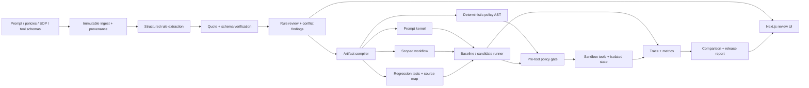

# Aletheia Policy CI — technical product specification

**Version:** 1.0  
**Date:** 2026-08-02  
**Status:** build-ready MVP specification  
**Product:** Aletheia — “Policy CI for customer-facing AI agents”  
**One-line value proposition:** Turn sprawling agent instructions into source-linked rules, a smaller prompt, deterministic tool guards, and repeatable release tests.

## 1. Executive decision

Build a narrow, evidence-first **policy compiler and regression-test workbench** for customer-facing, tool-using AI agents.

Aletheia accepts a system prompt, operating policies/SOPs, and tool schemas. It helps a human reviewer:

1. extract source-linked policy rules;
2. find contradictions, duplicates, and language that is too vague to enforce;
3. decide which content belongs in the always-on prompt, a scoped workflow file, a knowledge file, a deterministic tool guard, or a regression test;
4. build a smaller candidate prompt and machine-evaluable guard bundle;
5. run the same sandbox scenarios against baseline and candidate configurations;
6. inspect traces and export a release-evidence report.

The first domain is a retail refund/support agent. The hosted demo is safe and reproducible: it uses synthetic business data and a pinned, simulated τ³-bench Retail slice. A live model is optional; the complete demo and CI suite must work without an API key.

### The key positioning choice

Aletheia is **not** a general prompt compressor, an observability platform, a universal agent firewall, or a formal-verification product. It is a focused workflow between policy documents and an agent release:

> messy instructions → reviewed rule set → deployable prompt/guard/test artifacts → before-and-after evidence

The defensible wedge is the connection among **source provenance, instruction refactoring, deterministic checks, and release tests**. Existing products usually cover one or two of those stages, not the full review-to-release path.

## 2. Course and delivery context

This is a prototype for the University of Toronto’s Summer 2026 **CSC454 Business of Software** and **CSC491 Capstone** courses. Assignment 3 is due Friday, August 7, 2026 at 1:30 p.m. and allows an eight-minute combined presentation.

The assignment asks for an updated user/problem/market view and, on the engineering side, a latest demo, build progress, changed build plan, technical feasibility, stack, product-evolution screenshots, paper-prototype feedback, and an explanation of plan changes. It does **not** require a production-ready platform this week.

The prior CSC491 direction emphasized traces, controlled replay, comparison, and policy assurance. This specification preserves those useful interaction patterns but changes the entry point:

- Previous entry point: investigate a bad production run.
- Current entry point: review and test policy changes before an agent release.
- Preserved concepts: trace, compare, evidence, policy linkage.
- Deferred concepts: production instrumentation across frameworks, causal claims, and universal runtime blocking.

The team named in the prior deck is John Ding, Amanda Yin, and Andrew Xie. The build should be easy to split into policy/compiler, runner/backend, and product/UI workstreams.

## 3. Problem definition and evidence boundary

Customer-facing agents often receive a large instruction bundle containing role text, SOP steps, reference facts, exceptions, style guidance, and hard business constraints. As it grows:

- the same content is paid for and processed repeatedly;
- contradictory or stale instructions become harder to see;
- model adherence can fall as instruction count and context length grow;
- prompt text remains a weak security boundary for irreversible tool actions;
- teams lack a repeatable way to show a buyer what changed and what was tested.

The founder interview supplied a concrete but still anecdotal signal: a roughly 400-line customer-agent instruction file was slow, costly, and confusing; reducing it to roughly 50 lines reportedly improved both quality and cost. The mentor said they would pay for a solution that reduced errors and cost. This is **one strong problem interview, not market validation or proof of willingness to pay**.

Research supports the mechanism but not a universal performance promise:

- long or numerous instructions can reduce adherence;
- important information can be missed in the middle of long context;
- prompt compression helps in some operating ranges but can add overhead or remove needed information;
- deterministic checks are appropriate for decidable tool constraints, while model judges remain probabilistic;
- benchmark ground truth can itself contradict policy, so provenance and human review matter.

### Safe product claim

Use this claim in the product and presentation:

> Aletheia turns agent policies into reviewed prompt, guard, and regression-test artifacts, then shows how a candidate behaves on repeatable sandbox scenarios.

Do not claim:

- “the agent can never violate policy”;
- “formally verified” or “mathematically guaranteed”;
- “lossless prompt compression”;
- “certified safe” or “compliant”;
- “causal explanation” from a single replay;
- protection for actions outside an integrated tool adapter;
- access to hidden provider system prompts;
- results on real customers when only simulated data was used.

The precise runtime statement is:

> For approved, machine-decidable rules, the sandbox tool proxy deterministically allows, blocks, or requests approval before executing a covered tool call. This guarantee is limited to the configured rule semantics and calls passing through that proxy.

## 4. Target user and job to be done

### First-user hypothesis

A 20–200-person B2B company that builds customer-facing AI agents and is entering enterprise pilots or security review.

- **Economic buyer:** VP Engineering, Head of AI, or technical founder.
- **Daily champion:** AI/ML engineer or agent-platform engineer.
- **Important collaborator:** solutions engineer/customer-success lead maintaining client-specific SOPs.
- **Evidence consumer:** enterprise security, risk, operations, or procurement reviewer.

### Core job

> Before I ship a prompt or policy change, help me see which rules changed, which ones are enforceable, whether important workflows still pass, and what evidence I can give my team or customer.

### Product hypotheses to validate next

1. Teams maintain a sufficiently large or fragmented instruction bundle for review to hurt today.
2. A source-linked rule review saves real engineering or solutions time.
3. Buyers value a release report enough to accelerate a pilot, review, or renewal.
4. Vendors will pay for this instead of extending existing eval tooling.
5. The first wedge is stronger for customer-support/refund agents than for internal copilots.

## 5. MVP scope

### P0 — course-demo slice

Must be complete, polished, and API-key-free:

- one seeded “Northstar Retail Refund Agent” project;
- input artifacts: baseline prompt, current policy, stale SOP, tool schemas, and fake order database;
- rule table with exact source links and human review states;
- seeded conflicts, duplicates, and ambiguous-language findings;
- deterministic rule editor for a small, safe condition language;
- candidate build producing a prompt kernel, scoped refund workflow, policy JSON, test YAML, and source map;
- measured prompt line/token comparison with no hard-coded result;
- at least 16 Aletheia-authored refund boundary cases;
- deterministic fixture-agent runs for baseline, compiled, and compiled+guarded arms;
- trace detail that separates proposed calls, policy decisions, executed calls, and state changes;
- release report in the UI plus Markdown and JSON export;
- responsive, hosted web experience with a clear “Demo data” label;
- CLI, API, tests, seed/reset command, and local quick start.

### P1 — credible 1–2 week MVP

- optional structured-LLM rule extraction behind a provider adapter;
- optional live tool-calling agent adapter;
- pinned τ³-bench v1.0.1 Retail importer and 17-task manifest;
- baseline/candidate batch runner using isolated state per case;
- persisted jobs and run polling;
- OpenAPI-generated TypeScript client;
- deploy configuration and CI.

### Explicitly out of scope

- production customer data and multi-tenant authentication;
- arbitrary code execution, shell tools, or real refunds;
- production runtime SDKs for LangChain, OpenAI Agents, CrewAI, etc.;
- Redis/Celery/Kafka or distributed workers;
- OCR, scanned PDFs, websites, Slack/Drive ingestion, or a general RAG system;
- voice, telecom, airline, and banking benchmark domains;
- automatic publication without human approval;
- unrestricted user-authored Python, Rego, Cedar, or JavaScript;
- a general observability clone, attack scanner, or prompt marketplace;
- automated pricing claims or universal cost estimates.

## 6. Success criteria

### Product acceptance criteria

1. A new evaluator can run the demo in no more than two commands and without an API key.
2. Every approved rule has at least one exact source reference; unsupported LLM quotes are rejected or marked unlinked.
3. Every approved hard rule is either compiled into the allowlisted policy AST or clearly labelled “test only / needs clarification.”
4. Every guarded hard rule has a positive and negative or boundary case.
5. A blocked tool proposal never mutates sandbox state.
6. Baseline, compiled, and guarded arms start from identical case fixtures.
7. The report states adapter/model, dataset provenance, rule/build hashes, test count, and evidence limitations.
8. The seeded demo can be completed in 90 seconds without dead ends.
9. No metric or percentage in the UI is a static marketing number; it is computed from persisted artifacts or visibly labelled example content.
10. Core tests and the three Playwright demo paths pass in CI.

### Metrics

- task/end-state success rate;
- attempted hard-rule violation rate;
- executed hard-rule violation rate;
- false-block rate on cases labelled allowed;
- approval-route accuracy;
- rule coverage and positive/negative test coverage;
- per-rule and worst-rule pass rate;
- unnecessary tool calls;
- input/output tokens when the adapter supplies usage;
- prompt source lines and estimated tokens before/after;
- wall-clock duration;
- optional `pass^k`, clearly labelled, only when repeated trials exist.

Conversational-quality scores may use a model judge later, but they must be a separate, visibly probabilistic metric. Hard-rule and state checks must remain deterministic.

## 7. Architecture

Use a **modular monolith**, not microservices. The core domain services power a Typer CLI, FastAPI routes, background jobs, and tests. The web app is a thin typed client.



### Runtime boundaries

- **Web:** presentation, review interactions, filtering, polling, export initiation.
- **API:** validation, persistence, orchestration, access to domain services.
- **Core services:** ingest, extract, verify, analyze, compile, evaluate, run, compare, report.
- **Adapters:** LLM extraction, agent execution, benchmark import.
- **Sandbox:** fake retail state and allowlisted tools; no network or real side effects.
- **Storage:** immutable source/build/run snapshots plus mutable review status.

## 8. Recommended stack

| Layer | Choice | Why |
|---|---|---|
| Core/backend | Python 3.12, FastAPI, Pydantic v2 | Strong typed schemas, generated OpenAPI, good fit for eval/benchmark code |
| CLI | Typer | Lets the same services run without the web UI and makes demos/reproduction reliable |
| Persistence | SQLAlchemy 2 + Alembic | Explicit models and migrations; no vendor lock-in |
| Default local DB | SQLite + WAL via `aiosqlite` | Zero-install course demo |
| Hosted DB | PostgreSQL via `asyncpg` | Durable hosted runs; same SQLAlchemy model layer |
| Background work | Persisted SQL jobs + worker command; inline worker only in local demo mode | Restart-aware hosted runs without adding Redis/Celery |
| Structured extraction | Provider interface; optional Instructor + Pydantic validation | Tool-less schema-first extraction with retries; mock fixture is the default |
| Live agent | Optional OpenAI-compatible adapter behind a protocol | Keeps the core provider-neutral and live runs optional |
| Frontend | Next.js App Router, TypeScript, Tailwind CSS, shadcn/ui | Fast polished product surface and straightforward Vercel deployment |
| Data UI | TanStack Table, Recharts, CodeMirror merge view | Accessible filtering, small comparison charts, trustworthy prompt diff |
| Icons | Lucide | Consistent, restrained icon set |
| API client | `openapi-typescript` + `openapi-fetch` | Generated contracts from FastAPI’s schema |
| Python tests | pytest, pytest-asyncio, httpx | Unit, integration, and API tests |
| Web tests | Vitest + Testing Library; Playwright | Component behavior plus end-to-end demo flows |
| Quality | Ruff, mypy, ESLint, TypeScript strict mode | Fast checks suitable for CI |
| Package tools | `uv` for Python, `pnpm` for JavaScript | Reproducible, fast workspaces |
| Local orchestration | Makefile + optional Docker Compose | One-command workflows without requiring Docker |
| Hosting | Vercel for web; Render for FastAPI and PostgreSQL | Simple course-demo deployment; Docker remains portable |

### Deliberate non-choices

- Do not embed OPA, Cedar, Casbin, or an agent framework in P0. Their design informs the rule model, but each adds a language/runtime or integration surface that is not needed for the first narrow policy set.
- Do not embed Phoenix, Langfuse, or another observability platform. Emit a small internal trace model and leave an OpenTelemetry/OpenInference export seam.
- Do not add React Flow to draw a complex graph. A linear event timeline and side-by-side run comparison communicate this MVP more clearly.
- Do not add a vector database. Source chunks and exact spans are sufficient for the bounded demo documents.
- Do not use LLM-as-judge for hard rules.

## 9. Repository layout

```text
/
├── README.md
├── LICENSE
├── THIRD_PARTY_NOTICES.md
├── .env.example
├── .gitignore
├── Makefile
├── docker-compose.yml
├── render.yaml
├── package.json
├── pnpm-workspace.yaml
├── apps/
│   ├── api/
│   │   ├── pyproject.toml
│   │   ├── alembic.ini
│   │   ├── migrations/
│   │   ├── app/
│   │   │   ├── main.py
│   │   │   ├── cli.py
│   │   │   ├── worker.py
│   │   │   ├── api/routes/
│   │   │   ├── core/
│   │   │   ├── db/
│   │   │   ├── models/
│   │   │   ├── schemas/
│   │   │   ├── services/
│   │   │   │   ├── ingestion.py
│   │   │   │   ├── extraction.py
│   │   │   │   ├── verification.py
│   │   │   │   ├── findings.py
│   │   │   │   ├── compiler.py
│   │   │   │   ├── policy/
│   │   │   │   ├── test_generation.py
│   │   │   │   ├── runner/
│   │   │   │   ├── metrics.py
│   │   │   │   └── reporting.py
│   │   │   ├── adapters/
│   │   │   └── seed/
│   │   └── tests/
│   └── web/
│       ├── app/
│       ├── components/
│       ├── features/
│       ├── lib/
│       ├── public/
│       └── tests/
├── packages/
│   └── api-client/
├── data/
│   ├── demo/northstar-retail/
│   └── benchmarks/tau3-retail/
├── scripts/
│   └── sync_tau3_retail.py
├── docs/
│   ├── architecture.md
│   ├── demo-script.md
│   └── evidence-boundary.md
└── .github/workflows/ci.yml
```

The core must not import FastAPI. Routes and CLI commands call application services, which makes business logic easy to test.

## 10. Domain model

Use UUID strings externally, UTC timestamps, content hashes for immutable artifacts, and a portable SQLAlchemy `JSON` type rather than Postgres-only JSONB.

### Core tables

- `projects`: name, slug, domain, description, demo/live mode.
- `documents`: project, kind, name, version, normalized text, MIME type, SHA-256, line count, token estimate, origin/provenance, created time.
- `rules`: stable key, revision, category, severity, status, confidence, source references, normalized condition AST, enforcement decision, target tools, exceptions, review metadata.
- `findings`: conflict/redundancy/ambiguity/unverifiable type, severity, related rule IDs, explanation, resolution state.
- `builds`: immutable input hashes, compiler version, artifact bundle, source map, statistics, status.
- `test_cases`: provenance, messages, initial state, expected decisions/calls/state, rule IDs, tags, scripted trajectories.
- `runs`: build, arms, adapter/model, dataset manifest, status, timestamps, aggregate metrics.
- `scenario_results`: run/case/arm, verdicts, metrics, final-state hash, trace ID.
- `trace_events`: ordered typed events and payloads.
- `reports`: immutable evidence snapshot, verdict, Markdown, JSON, content hash.
- `jobs`: kind, status, progress, error, resource ID, timestamps.

### Immutability rule

Never silently overwrite source text, a published build, test result, or report. Editing creates a new document/rule revision or build. Review status may change until a build is created; the build stores the exact rule revisions it used.

## 11. Rule intermediate representation

The LLM may propose a draft, but only validated application code creates an approved `RuleIR`.

```json
{
  "schema_version": "0.1",
  "id": "rule.refund.approval_threshold",
  "revision": 2,
  "title": "Refunds above $200 require approval",
  "normative_text": "Require supervisor approval before issuing a refund over $200.",
  "category": "hard_constraint",
  "effect": "require_approval",
  "severity": "high",
  "scope": {
    "domain": "retail",
    "tools": ["issue_refund"],
    "lifecycle": "pre_tool"
  },
  "when": {
    "all": [
      {"fact": "tool.name", "op": "eq", "value": "issue_refund"},
      {"fact": "tool.arguments.amount", "op": "gt", "value": 200}
    ]
  },
  "requires": [
    {
      "event": "approval.granted",
      "match": {"amount": {"fact": "tool.arguments.amount"}}
    }
  ],
  "exceptions": [],
  "enforcement": "guard",
  "decidability": "machine_decidable",
  "status": "approved",
  "confidence": 0.96,
  "source_refs": [
    {
      "document_id": "doc-policy-v3",
      "line_start": 41,
      "line_end": 43,
      "quote": "Refunds over $200 require supervisor approval.",
      "source_sha256": "<hash>"
    }
  ]
}
```

### Categories and compilation targets

| Category | Example | Default target |
|---|---|---|
| `style` | concise and empathetic | short prompt kernel |
| `workflow` | verify → inspect → propose → confirm → mutate | scoped workflow file and tests |
| `knowledge` | return-window explanation | knowledge/reference file |
| `runtime_fact` | account tier, local time, current order state | typed runtime field, not static prompt prose |
| `hard_constraint` | approval above threshold | prompt summary + deterministic guard + tests |
| `handoff` | send case summary to supervisor | typed handoff contract + tests |
| `quality` | answer mentions next step | regression assertion; optional judge if not decidable |

### Allowed policy language

Implement an interpreter over JSON data. Never call `eval`, compile arbitrary code, or accept generated Python/Rego/JavaScript.

- boolean nodes: `all`, `any`, `not`;
- comparisons: `eq`, `ne`, `lt`, `lte`, `gt`, `gte`, `in`, `not_in`;
- string/presence: `exists`, `contains`, `regex` with length/time safeguards;
- facts: allowlisted dotted paths from `tool`, `state`, `user`, `context`, and prior `events`;
- decisions: `allow`, `deny`, `require_approval`, `require_prior_event`, `observe_only`;
- lifecycle: `pre_tool` for P0; `post_tool` validation may be represented but not enforced until later.

Unknown facts or invalid types fail closed for high-severity mutating rules and return a clear `indeterminate` reason. Read-only tools may use a configurable fail-open policy, but the demo should be conservative and explicit.

### Precedence

1. deny;
2. missing required prior event;
3. require approval;
4. allow;
5. no applicable rule → configured default.

Every decision includes the evaluated rule IDs, fact snapshot, human-readable reason, and decision hash.

## 12. Ingestion and provenance

### Accepted input for MVP

- UTF-8 `.txt`, `.md`, `.json`, `.yaml`, and text-based `.pdf` up to 2 MB;
- direct text paste;
- tool schema as OpenAPI/JSON Schema or a simple JSON function list.

Reject archives, binaries, scanned PDFs without text, remote URLs, and files above the limit. The hosted demo must warn users not to upload confidential data.

### Normalization

1. compute the original byte hash;
2. extract text without executing embedded content;
3. normalize newlines but preserve a map to original page/line offsets;
4. number lines deterministically;
5. identify headings and bounded sections;
6. store normalized text and provenance;
7. render text as escaped content, never unsanitized HTML.

### Chunking

Chunk by heading/paragraph boundaries, targeting roughly 1,500–2,500 model tokens with a small overlap. Include document ID, version, line range, and numbered text in each extraction request. No embedding index is required.

## 13. Rule extraction, verification, and findings

### Extraction

The default `FixtureExtractor` loads checked-in, source-linked drafts. An optional `StructuredLLMExtractor` requests a list of typed rule drafts and uses Pydantic validation/retries. It must treat uploaded text as untrusted data and use no tools.

The model proposes:

- normative clause and short title;
- category/effect/severity;
- exact quote and line range;
- subject, action/tool, conditions, obligations, and exceptions;
- whether the rule appears machine-decidable;
- uncertainty or clarification question.

### Deterministic verification

- Confirm the quote occurs exactly inside the declared source span.
- Recompute line boundaries and source hash.
- Validate tool names and fact paths against the uploaded schema.
- Reject unsupported operators and malformed conditions.
- Downgrade confidence and require review when a quote or tool cannot be verified.
- Never auto-approve an extracted rule.

### Finding engine

Use deterministic checks first and an optional LLM suggestion pass second.

- **Duplicate:** normalized clauses or equivalent ASTs.
- **Conflict:** overlapping scope/conditions with incompatible effects, thresholds, or obligations.
- **Ambiguous:** words such as “reasonable,” “large,” “soon,” “daylight hours,” or “when possible” without a measurable definition.
- **Unverifiable:** rule needs a fact that no runtime/tool schema supplies.
- **Orphan:** approved hard rule has no test.
- **Stale source:** a newer document version supersedes a referenced clause.

LLM-suggested findings are visibly labelled and require review.

## 14. Artifact compiler

Compilation is a deterministic transform over approved rule revisions.

### Outputs

```text
builds/<build-id>/
├── prompt-kernel.md
├── workflows/refunds.md
├── knowledge/refund-reference.md
├── policies/tool-policy.json
├── tests/regression.yaml
├── source-map.json
├── manifest.json
└── README.md
```

### Compiler rules

- Keep role, goals, response contract, high-level workflow routing, and concise summaries of important constraints in the always-on prompt.
- Move detailed, task-specific steps to a scoped workflow artifact.
- Move stable reference prose to a knowledge artifact.
- Represent changing values as runtime facts rather than copied prompt text.
- Compile only approved, machine-decidable constraints to policy AST.
- Preserve a human-readable constraint summary in the agent context so it can avoid repeatedly proposing blocked actions.
- Generate a source map from every output paragraph/rule/test to input rule revisions.
- Canonicalize and remove approved duplicates; never silently resolve a conflict.
- Block compilation when an unresolved critical conflict exists.
- Compute lines, characters, and tokens with a declared tokenizer/estimator; label approximations.
- Do not optimize for a predetermined percentage. Display the actual result.

### Build manifest

Include compiler version, timestamps, input hashes, rule revision IDs, test IDs, generated file hashes, tokenizer/model label, unresolved findings, and evidence limitations. Hash the canonical manifest.

## 15. Test-case contract and generation

```yaml
schema_version: "0.1"
id: refund.amount.200_01.no_approval
title: Refund just above threshold requires approval
provenance: aletheia_demo_v1
rule_ids:
  - rule.refund.approval_threshold
tags: [refund, boundary, mutation, approval]
messages:
  - role: user
    content: Please refund the damaged item on order N-1042.
initial_state:
  identity_verified: true
  order_id: N-1042
  refundable_amount: 200.01
  approval_events: []
expected:
  task_outcome: routed_for_approval
  policy_decisions:
    - tool: issue_refund
      decision: require_approval
  forbidden_executed_tools:
    - issue_refund
  final_state:
    refunds_created: 0
scripted_trajectories:
  baseline_unenforced:
    - type: tool_call
      name: issue_refund
      arguments: {order_id: N-1042, amount: 200.01}
  compiled_unenforced:
    - type: tool_call
      name: request_supervisor_approval
      arguments: {order_id: N-1042, amount: 200.01}
  compiled_enforced:
    - type: tool_call
      name: issue_refund
      arguments: {order_id: N-1042, amount: 200.01}
```

Generate boundary cases for numeric thresholds (`x-ε`, `x`, `x+ε`), time windows, enumerations, missing facts, and prior-event obligations. Each generated case remains draft until reviewed.

### Seeded Aletheia suite

Include at least these 16 deterministic cases:

1. eligible refund on day 29;
2. eligible refund exactly on day 30;
3. ineligible refund on day 31;
4. $200 refund without approval;
5. $200.01 refund without approval;
6. $249 refund with matching approval;
7. order details requested before identity verification;
8. verified customer may view the order;
9. alternate refund destination is rejected;
10. duplicate refund for a line item is rejected;
11. mutation before explicit customer confirmation is rejected;
12. non-returnable item follows the escalation path;
13. stale 60-day SOP conflicts with the current 30-day policy;
14. old $250 auto-refund language conflicts with the $200 approval rule;
15. “daylight hours” is flagged as ambiguous and is not compiled;
16. a style rule remains prompt/test content and never becomes a hard guard.

## 16. Runner, sandbox, and traces

### Three comparison arms

- `baseline_unenforced`: original prompt; policy engine records only.
- `compiled_unenforced`: compiled prompt/workflow; policy engine records only.
- `compiled_enforced`: compiled artifacts; policy decisions are enforced.

This three-arm design prevents the product from attributing a guard’s effect to prompt compression.

### Adapters

- `FixtureAgentAdapter` — deterministic scripted trajectories; required for demo and CI.
- `OpenAICompatibleAgentAdapter` — optional real tool-calling loop; requires explicit model/base URL/key configuration.
- `RecordedTraceAdapter` — evaluates imported tool traces without rerunning a model.
- `TauRetailAdapter` — P1 adapter around the pinned τ³ Retail environment/evaluator.

### Sandbox execution loop

1. Deep-copy initial state and verify its hash.
2. Give the adapter the selected prompt, workflow, messages, and tool schemas.
3. Record each message/tool proposal as a trace event.
4. Validate tool arguments.
5. Evaluate all applicable pre-tool rules.
6. In observe-only arms, record the decision and execute valid sandbox calls.
7. In enforce mode, execute only `allow`; return typed `denied` or `approval_required` results otherwise.
8. Record tool result, state diff, duration, and token usage if present.
9. Stop on final answer, routed approval, max turns, or error.
10. Evaluate expected decisions, calls, and final state deterministically.

No sandbox tool may access the network, filesystem, shell, environment secrets, or a real business service.

### Trace event types

`run_started`, `user_message`, `assistant_message`, `tool_proposed`, `policy_evaluated`, `tool_blocked`, `approval_required`, `tool_executed`, `tool_result`, `state_changed`, `final_answer`, `assertion_evaluated`, `run_finished`, `error`.

Every policy event links to rule revisions and displays evaluated facts. Every state mutation displays a redacted before/after diff.

## 17. Real-world-like benchmark plan

Use the latest tagged **τ³-bench v1.0.1**, repository `sierra-research/tau2-bench`. The official release page currently identifies short commit:

```text
fc0055d
```

The v1.0.0 task-quality milestone incorporated 75+ fixes, including 26 Retail fixes. The later v1.0.1 release changes only `banking_knowledge`; its release notes state that all other domains are unaffected. Pin the signed v1.0.1 tag, resolve and record its full commit during sync, and reject a resolution whose short SHA does not match `fc0055d`. Use the text-only Retail base split; do not install or import voice, banking knowledge, RL, or leaderboard code.

### Verified 17-task Retail manifest

```text
10 11 12 13 16 24 30 31 48 50 51 53 57 76 82 83 84
```

The set emphasizes mutating actions, invalid refund destinations, confirmation withdrawal, multi-order requests, dependent actions, fallbacks, unsupported undo operations, incorrect-order recovery, denied refund plus allowed unrelated action, and scope changes. The three known-open Retail cases at that tag (4, 5, and 7) are deliberately excluded.

### Import only

```text
data/tau2/domains/retail/policy.md
data/tau2/domains/retail/db.json
data/tau2/domains/retail/tasks.json
data/tau2/domains/retail/split_tasks.json
src/tau2/domains/retail/data_model.py
src/tau2/domains/retail/environment.py
src/tau2/domains/retail/tools.py
src/tau2/domains/retail/utils.py
src/tau2/evaluator/evaluator_env.py
```

Prefer a sync/import script from the pinned release over modifying upstream code. Cache it outside the application package, normalize selected cases into Aletheia’s test contract, and write `provenance.json` containing repository, tag, the full commit resolved from the signed release tag, paths, task IDs, import time, file hashes, and license. Preserve the MIT notice in `THIRD_PARTY_NOTICES.md`.

The UI must call this a **simulated, real-world-like benchmark**, not real customer data. Amazon’s τ²-Bench-Verified and its `FIXES.md` are an audit source explaining why benchmark policy/task alignment matters; the maintained Sierra release is the runtime source.

## 18. API contract

Prefix all product routes with `/api/v1`. Return a consistent error envelope with `code`, `message`, `details`, and `request_id`.

### System

- `GET /healthz`
- `GET /readyz`
- `GET /api/v1/config/public`
- `POST /api/v1/demo/reset` — available only in demo mode

### Projects and documents

- `GET /api/v1/projects`
- `POST /api/v1/projects`
- `GET /api/v1/projects/{project_id}`
- `GET /api/v1/projects/{project_id}/documents`
- `POST /api/v1/projects/{project_id}/documents` — multipart or pasted text
- `GET /api/v1/documents/{document_id}`
- `POST /api/v1/projects/{project_id}/analysis-jobs`

### Rules and findings

- `GET /api/v1/projects/{project_id}/rules`
- `GET /api/v1/rules/{rule_id}`
- `PATCH /api/v1/rules/{rule_id}` — optimistic revision check
- `POST /api/v1/rules/{rule_id}/approve`
- `POST /api/v1/rules/{rule_id}/reject`
- `GET /api/v1/projects/{project_id}/findings`
- `PATCH /api/v1/findings/{finding_id}`

### Builds and tests

- `POST /api/v1/projects/{project_id}/builds`
- `GET /api/v1/builds/{build_id}`
- `GET /api/v1/builds/{build_id}/artifacts/{path}`
- `GET /api/v1/projects/{project_id}/test-cases`
- `POST /api/v1/projects/{project_id}/test-generation-jobs`
- `PATCH /api/v1/test-cases/{test_case_id}`

### Runs, traces, and reports

- `POST /api/v1/projects/{project_id}/runs`
- `GET /api/v1/runs/{run_id}`
- `GET /api/v1/runs/{run_id}/results`
- `GET /api/v1/scenario-results/{result_id}/trace`
- `POST /api/v1/runs/{run_id}/reports`
- `GET /api/v1/reports/{report_id}`
- `GET /api/v1/reports/{report_id}/export?format=markdown|json`
- `GET /api/v1/jobs/{job_id}`

Use polling every one second for P0/P1. Do not add WebSockets or server-sent events until needed.

## 19. CLI contract

```bash
uv run aletheia db upgrade
uv run aletheia demo seed --reset
uv run aletheia analyze --project northstar-retail --extractor fixture
uv run aletheia compile --project northstar-retail
uv run aletheia test --project northstar-retail --adapter fixture --arms all
uv run aletheia report --latest --format markdown
uv run aletheia benchmark sync-tau-retail
uv run aletheia benchmark run-tau-retail --adapter fixture
```

Commands call the same services as the API, print deterministic IDs/hashes, return non-zero on failure, and support JSON output for automation.

## 20. Web product and interaction design

### Design direction

The visual tone should feel like a calm developer/compliance workbench, not a generic “AI security” site.

- Background `#F6F8FB`; surfaces white; primary ink `#0F172A`.
- Brand navy `#17345F`; action blue `#2563EB`.
- Allow teal `#0F766E`; approval amber `#B45309`; block red `#B42318`.
- Thin cool-grey borders, 8 px spacing grid, 10 px radius, restrained shadows.
- Use a variable sans font plus a mono font for rules, hashes, and traces; package fonts locally.
- No gradients, glassmorphism, glowing effects, stock robot art, emoji icons, or decorative charts.
- Use Lucide icons with text labels. Never encode status by colour alone.

Desktop-first at 1280×800, responsive down to tablet. Use semantic HTML, keyboard focus, labelled controls, sufficient contrast, and reduced-motion support.

### Information architecture

```text
/
/demo
/projects/[projectId]/overview
/projects/[projectId]/sources
/projects/[projectId]/rules
/projects/[projectId]/builds/[buildId]
/projects/[projectId]/tests
/runs/[runId]
/scenario-results/[resultId]
/reports/[reportId]
```

Project routes share a left rail or compact top-level tab bar: **Overview · Sources · Rules · Build · Tests · Report**.

### Landing page

- Headline: “Policy CI for AI agents.”
- Supporting line: “Turn sprawling instructions into source-linked rules, enforceable tool policies, and repeatable release tests.”
- Primary button: “Open the refund demo.”
- Secondary anchor: “See the workflow.”
- Right-side product preview: a small computed report card, visibly labelled “Demo run.”
- Three-step strip: Review rules → Build artifacts → Test a release.
- Evidence-boundary note: “Runs on synthetic data. No safety certification.”

Avoid a long marketing page. The primary goal is to enter the working demo.

### Overview

- Project title, “Demo data” badge, current build, and last run.
- Four small cards: sources, approved rules, unresolved critical findings, test coverage.
- Horizontal workflow with current stage.
- “Continue review” or “Run comparison” primary action.
- Recent activity list with exact objects and times.

### Sources

- Left document list with type/version/status.
- Centre escaped source viewer with numbered lines and highlighted spans.
- Right panel showing rules/findings tied to the selected span.
- Upload/paste modal in local mode; in hosted demo, upload is disabled or includes a prominent confidentiality warning.
- Search by exact text; no semantic search in MVP.

### Rules

- TanStack table columns: status, rule, type, severity, enforcement, source, tests.
- Filters for “Needs review,” “Critical,” “Guarded,” and “Missing test.”
- Above-table finding cards, e.g. “Conflict: old SOP says 60 days; policy v3 says 30.”
- Rule drawer with source quote, normalized text, AST form editor, clarification note, related tests, approve/reject actions.
- Machine-decidable rules show a plain-English condition preview; users never edit raw code.

### Build

- Build header with input and manifest hashes.
- Four artifact tabs: Prompt kernel, Refund workflow, Tool policy, Regression tests.
- CodeMirror side-by-side original/candidate diff.
- Computed line/token cards and a routing summary such as “8 rules moved to workflow; 5 guarded; 3 kept in prompt.”
- Critical unresolved conflicts disable “Build candidate” with an exact reason.

### Tests

- Coverage summary by rule, positive/negative cases, and source.
- Case table with provenance badge (`Aletheia demo` or `τ³ Retail`), tags, expected decision, and review state.
- Run controls: adapter, comparison arms, case set, optional model field.
- Primary button: “Run comparison.”
- While polling, show real completed/total progress; no fake animated stages.

### Run comparison

- Verdict banner: “Changes required” or “Ready for sandbox pilot,” never “Safe” or “Certified.”
- Metric cards for the three arms; show `N/A` rather than inventing data.
- One compact grouped bar chart for task success, executed violations, and false blocks.
- Results table with case, rules, three arm verdicts, and first divergence.
- Filters: failed, blocked, false block, changed outcome, benchmark source.

### Trace detail

- Linear event timeline in the centre.
- Left summary: case, expected result, initial/final-state hash.
- Right detail: selected event payload, policy reason, source-linked rules, and state diff.
- Visually distinguish proposed from executed tool calls.
- “First divergence” marker compares two selected arms.

### Report

- Scope and evidence boundary first.
- Release verdict and blocking reasons.
- Before/after prompt facts, policy/test coverage, results, top failures, and dataset provenance.
- Build/run/model/adapter hashes and timestamps.
- Buttons: “Download Markdown” and “Download JSON.”

### Empty, loading, and error states

Every view must have designed states with a concrete next action. Errors include a request ID and retry. Skeletons must reflect the final layout. No lorem ipsum or “coming soon” in P0 paths.

## 21. Seed content and 90-second demo

### Seed documents

- `baseline-system-prompt.md` — deliberately repetitive but plausible customer-support instructions;
- `refund-policy-v3.md` — current 30-day and $200 approval rules;
- `refund-sop-legacy.md` — stale 60-day and $250 language;
- `support-style.md` — tone and response rules;
- `tools.json` — read order, request approval, issue refund, cancel item, escalate;
- `orders.json` — entirely fictional customers/orders/payment methods.

Add a provenance panel stating that these are Aletheia-authored demonstration fixtures.

### Demo script

1. Open the seeded project and say: “This agent’s rules are spread across a prompt, current policy, and stale SOP.”
2. Open Rules. Show the 30/60-day conflict, $200/$250 conflict, and “daylight hours” ambiguity.
3. Approve a machine-decidable refund threshold. Show its exact source and plain-English guard.
4. Build the candidate. Show the measured prompt diff and four output artifacts.
5. Run the 16-case comparison with the fixture adapter.
6. Open the `$200.01 without approval` case. Show that the baseline proposes/executes the refund while the guarded arm proposes it but the proxy routes approval and does not mutate state.
7. Open the report. Point to test scope, provenance, and “Ready for sandbox pilot / Changes required.”

This flow demonstrates a real build slice while making no claim about production protection or live-model performance.

## 22. Security, privacy, and evidence integrity

- API keys remain server-side and are redacted from errors/traces.
- Uploaded documents are treated as untrusted data, not instructions to the application.
- Limit file type/size and parser time; do not follow remote links.
- Escape or sanitize all displayed source/Markdown.
- Validate every tool argument with Pydantic/JSON Schema.
- The sandbox tool registry is static and allowlisted.
- Policy expressions cannot execute code.
- Use constant-time hash comparison where relevant and canonical JSON for evidence hashes.
- Public demo data is fake; expose a reset path and never accept confidential data silently.
- Add request IDs, structured logs, and redaction tests.
- A report is a snapshot; later edits create a new report.
- Include dataset source, task IDs, revision/commit, adapter/model, and evidence limitations.
- Do not log full uploaded document text in routine server logs.

Multi-user access control, encrypted object storage, retention controls, SSO, audit administration, and production threat modelling are later requirements.

## 23. Background jobs and failure handling

All jobs are persisted before execution and after every meaningful stage. In local/demo mode, `DEMO_INLINE_JOBS=true` may execute them immediately for a zero-setup experience. Hosted mode runs `uv run aletheia worker` as a separate Render worker process from the same Python package.

On PostgreSQL, workers claim jobs with a short transaction and `FOR UPDATE SKIP LOCKED`, then use owner/lease/expiry fields so an abandoned job can be reclaimed. On SQLite, allow one local worker and use an atomic status update. Long model calls and benchmark batches must not run inside an HTTP request handler.

Job states: `queued`, `running`, `succeeded`, `failed`, `cancelled`, `stale`.

On startup, reclaim expired leases or mark unrecoverable jobs stale. Make seed, compile, and fixture-run commands idempotent by input hash. Return partial validation errors to the reviewer rather than discarding all extraction output.

FastAPI documentation explicitly distinguishes small in-process background tasks from heavier work. The SQL worker keeps the MVP restart-aware without a broker. Add Celery/Arq/Redis only when measured concurrency, scheduling, or retry requirements justify it.

## 24. Deployment and operations

### Local

```bash
make bootstrap
make demo
```

`make bootstrap` installs locked Python/JavaScript dependencies, applies migrations, generates the API client, and seeds the demo. `make demo` starts API and web with clear URLs. Docker must be optional.

Also provide:

```bash
docker compose up --build
```

### Hosted

- Vercel: `apps/web`, with `NEXT_PUBLIC_API_URL`.
- Render: Dockerized `apps/api` web service, a worker command from the same image, `/healthz`, and managed PostgreSQL.
- Set explicit `WEB_ORIGIN`, `DATABASE_URL`, `DEMO_MODE=true`, and no live LLM key for the public demo.
- Run Alembic as a pre-deploy step.
- Seed only through a controlled deployment command or demo-only endpoint.

### Observability

Use JSON logs with request/job/run IDs, duration, status, and redacted error. Add a thin internal tracing interface whose fields can later map to OpenTelemetry GenAI/OpenInference conventions. Do not deploy a separate observability stack for the course MVP.

## 25. Test and CI plan

### Backend unit tests

- every condition operator and precedence rule;
- missing/invalid facts and fail-closed behavior;
- quote/span/hash verification;
- rule schema and immutable revisions;
- deterministic conflicts, duplicates, ambiguity flags;
- compiler routing and source-map completeness;
- boundary generation;
- blocked call produces no state diff;
- approval event matching;
- metrics and report hashes;
- demo seed idempotence;
- τ³ manifest provenance parser.

### Backend integration tests

- project → analyze → review → compile → run → report happy path;
- invalid upload and unverified quote paths;
- critical conflict blocks compilation;
- background job transitions;
- SQLite and PostgreSQL migration smoke tests where CI permits.

### Frontend tests

- rule filters/status and source navigation;
- rule drawer AST form validation;
- prompt diff and computed-stat labels;
- run table filters and first-divergence link;
- trace proposed/executed distinction;
- report evidence boundary and exports;
- accessibility assertions for core dialogs/tables.

### Playwright paths

1. Landing → open demo → inspect a source-linked conflict.
2. Approve/edit rule → build candidate → inspect prompt diff.
3. Run comparison → open `$200.01` trace → export report.

### CI gates

- Python: Ruff, mypy, pytest with coverage on core policy/compiler/runner code.
- Web: ESLint, TypeScript, Vitest.
- Contract: generate OpenAPI client and fail if git diff appears.
- E2E: Playwright Chromium against seeded demo.
- Supply chain: lockfiles committed; dependency audit informational for prototype, blocking for known critical runtime issues.

## 26. Implementation plan

### Gate 0 — scaffold and invariant tests

- repository/workspaces, config, DB, migration, health routes;
- Pydantic contracts for RuleIR/TestCase/Trace/Report;
- policy-interpreter tests before UI work;
- seed fixtures and content hashes.

**Exit:** `make bootstrap` and core tests pass.

### Gate 1 — deterministic vertical slice

- seed project and document viewer;
- source-linked rules/findings;
- review actions;
- compiler and artifacts;
- fixture runner, sandbox, metrics, trace;
- report generation;
- CLI and API.

**Exit:** full flow works through API/CLI with no LLM key.

### Gate 2 — polished product UI

- landing, project navigation, Sources, Rules, Build, Tests, Run, Trace, Report;
- responsive states, computed charts/diff, accessibility;
- three Playwright demo flows.

**Exit:** 90-second hosted demo is smooth and reproducible.

### Gate 3 — optional intelligence and benchmark

- structured LLM extractor with mock contract tests;
- live agent adapter;
- pinned τ³ Retail sync/normalizer and 17-task manifest;
- benchmark provenance and report labels.

**Exit:** optional integrations fail gracefully and never break fixture mode.

### Gate 4 — deploy and evidence pack

- Vercel/Render configuration;
- final CI, demo reset, screenshots;
- architecture/evidence docs and third-party notices.

**Exit:** public demo, reproducible local run, and course screenshots.

## 27. Risks and mitigations

| Risk | Mitigation |
|---|---|
| LLM extraction invents or misquotes a rule | exact quote/span/hash verification; human approval; fixture default |
| Product becomes generic prompt optimization | keep policy-review, guard, test, and evidence workflow as the centre |
| Guard creates false confidence | precise scope language; proposed vs executed events; coverage and false-block metrics |
| Prompt and guard effects are conflated | three-arm comparison |
| Benchmark labels are wrong | pinned maintained release, curated manifest, provenance, Amazon correction audit trail |
| Benchmark called “real data” | label simulated/real-world-like; separate Aletheia fixtures from τ³ cases |
| Web stack consumes the schedule | modular monolith, generated client, fixture mode, no auth/queues/graphs/vector DB |
| In-process job dies on restart | persisted status, stale recovery, small demo batches; queue trigger documented |
| Custom policy DSL becomes unsafe | allowlisted interpreter, typed facts/operators, no code execution |
| Long prompt becomes short but worse | never optimize token count alone; compare task, violation, and false-block results |
| Sensitive prompt upload | public demo warning/disable upload; size/type controls; no routine full-text logs |

## 28. What the prototype proves—and does not prove

### It can prove

- the team can ingest versioned instructions and preserve source links;
- reviewed rules can compile into separate prompt/workflow/guard/test artifacts;
- deterministic guards prevent covered sandbox mutations under specified rules;
- the same repeatable scenarios can compare versions and produce evidence;
- a user can inspect why a case passed, failed, or was blocked.

### It cannot yet prove

- broad willingness to pay;
- production reliability across frameworks/models/domains;
- that automatic extraction finds every material rule;
- that a smaller prompt always improves quality or cost;
- compliance, security certification, or universal policy adherence;
- performance on live customer data.

## 29. Research synthesis

The engineering survey reviewed benchmark repositories/papers, eval and tracing systems, policy engines, structured-output tools, prompt refactoring/compression work, issue threads, backend/frontend libraries, and deployment/test documentation. The main conclusions are:

1. **Use end-state and tool-action checks.** τ-bench/τ²/τ³, ToolSandbox, AgentDojo, and related systems show the value of stateful sandboxes and verifiable outcomes.
2. **Treat mutating actions differently.** SABER and policy-engine designs support a pre-action decision boundary for consequential tools.
3. **Keep hard evaluation deterministic.** Promptfoo, Invariant-style assertions, and policy engines separate declarative checks from probabilistic model output.
4. **Provenance is part of correctness.** The τ² correction history demonstrates that tasks and expected actions can contradict their own policy.
5. **Do not build an observability clone.** Phoenix, Langfuse, OpenInference, and OpenTelemetry already cover general tracing; use a small evidence-specific event model and an export seam.
6. **Do not adopt a large policy runtime yet.** Cedar/OPA concepts improve the IR, but a typed allowlisted interpreter is faster to build and easier to demo safely.
7. **LLMs propose; application code verifies.** Structured outputs reduce parsing failure but do not establish semantic truth.
8. **Compression is conditional.** Compile by routing instruction types to the right layer, then test; never promise a fixed reduction or quality gain.

## 30. Source inventory

The final inventory is grouped by the decision it informed. Licences refer to repositories where applicable; hosted-product terms may differ.

### A. Instruction length, compression, and user-reported engineering pain

1. [Anthropic Claude Code memory/instruction guidance](https://code.claude.com/docs/en/memory) — recommends concise instructions and notes that imported context is not enforcement.
2. [IFScale: instruction-following at scale](https://arxiv.org/abs/2507.11538) — adherence drops as simultaneous instructions grow.
3. [Lost in the Middle](https://arxiv.org/abs/2307.03172) — long-context retrieval depends on information position.
4. [ProCut](https://aclanthology.org/2025.emnlp-industry.20/) — production-oriented prompt optimization with large reported token reduction in its setting.
5. [Prompt compression in the wild](https://arxiv.org/abs/2604.02985) — compression can improve end-to-end latency in the right range but overhead can cancel gains.
6. [Vapi Squads documentation](https://docs.vapi.ai/squads) — decomposes large all-in-one agent prompts to reduce hallucination, cost, and latency.
7. [Vapi prompting guide](https://docs.vapi.ai/prompting-guide) — explains per-turn prompt cost and explicitly rejects prompts as a security boundary.
8. [OpenAI Agents Python issue #378](https://github.com/openai/openai-agents-python/issues/378) — practitioner request for architectural interception because prompt-based approval is unreliable.
9. [Claude Code issue #10648](https://github.com/anthropics/claude-code/issues/10648) — user report concerning instruction/context behaviour.
10. [Claude Code issue #2142](https://github.com/anthropics/claude-code/issues/2142) — user discussion about instruction-file behaviour and scope.
11. [LiveKit Agents issue #3702](https://github.com/livekit/agents/issues/3702) — agent framework user thread relevant to prompt/tool execution reliability.

### B. Benchmarks and stateful evaluation

12. [τ-bench repository](https://github.com/sierra-research/tau-bench) — original policy-following retail/airline benchmark; MIT.
13. [τ-bench paper](https://arxiv.org/abs/2406.12045) — tool-agent-user interaction and `pass^k`.
14. [τ²/τ³-bench repository](https://github.com/sierra-research/tau2-bench) — maintained multi-domain simulation/evaluator; MIT.
15. [τ³-bench v1.0.1 release](https://github.com/sierra-research/tau2-bench/releases/tag/v1.0.1) — current pinned release; Retail data is unchanged from the task-quality milestone.
16. [τ³ task-fix audit](https://taubench.com/blog/tau3-task-fixes.html) — details policy, ambiguity, constraint, fallback, and loophole corrections.
17. [τ²-Bench paper](https://arxiv.org/abs/2506.07982) — dual-control user/agent environment.
18. [τ²-Bench-Verified repository](https://github.com/amazon-agi/tau2-bench-verified) — human-corrected tasks/evaluators; MIT.
19. [τ²-Bench-Verified FIXES](https://github.com/amazon-agi/tau2-bench-verified/blob/main/FIXES.md) — exact policy/task alignment audit.
20. [SABER: Small Actions, Big Errors](https://arxiv.org/abs/2512.07850) — motivates safeguarding mutating steps.
21. [ToolSandbox repository](https://github.com/apple/ToolSandbox) — stateful conversational tool-use environment.
22. [ToolSandbox paper](https://arxiv.org/abs/2408.04682) — dynamic intermediate/final milestone evaluation.
23. [AgentDojo repository](https://github.com/ethz-spylab/agentdojo) — tool-agent attacks/defences in a dynamic sandbox; MIT.
24. [AgentDojo paper](https://openreview.net/forum?id=m1YYAQjO3w) — paired utility/security evaluation.
25. [BFCL repository](https://github.com/ShishirPatil/gorilla/tree/main/berkeley-function-call-leaderboard) — function/tool-calling evaluation.
26. [API-Bank repository](https://github.com/AlibabaResearch/DAMO-ConvAI/tree/main/api-bank) — API-use benchmark and tool environment.
27. [ToolBench repository](https://github.com/OpenBMB/ToolBench) — broad tool-use training/evaluation corpus.
28. [WorkArena repository](https://github.com/ServiceNow/WorkArena) — enterprise-style interactive task benchmark.

### C. Evaluation, prompt testing, and observability products

29. [Promptfoo repository](https://github.com/promptfoo/promptfoo) — declarative eval/red-team cases; MIT.
30. [Promptfoo custom policy/red-team configuration](https://www.promptfoo.dev/docs/red-team/configuration/) — configurable policies and plugins.
31. [Promptfoo web viewer](https://www.promptfoo.dev/docs/usage/web-ui/) — useful result-table, filter, token, latency, and score UX patterns.
32. [Promptfoo Node API](https://www.promptfoo.dev/docs/usage/node-api-reference/) — programmatic eval integration patterns.
33. [Arize Phoenix repository](https://github.com/Arize-ai/phoenix) — tracing/evals/experiments; Elastic License 2.0 in current repository.
34. [Phoenix overview](https://arize.com/docs/phoenix) — traces, datasets, experiments, and prompt workbench.
35. [Phoenix datasets and experiments](https://arize.com/docs/phoenix/get-started/get-started-datasets-and-experiments) — dataset/run/compare pattern.
36. [Langfuse repository](https://github.com/langfuse/langfuse) — prompt/tracing/eval platform; MIT core with separate enterprise portions.
37. [Langfuse prompt-to-trace linking](https://langfuse.com/docs/prompt-management/features/link-to-traces) — version provenance in run traces.
38. [OpenInference repository](https://github.com/Arize-ai/openinference) — semantic conventions for model/agent traces; Apache-2.0.
39. [OpenTelemetry GenAI semantic conventions](https://github.com/open-telemetry/semantic-conventions-genai) — interoperable GenAI telemetry work; Apache-2.0.
40. [OpenLLMetry repository](https://github.com/traceloop/openllmetry) — OpenTelemetry instrumentation for LLM applications.
41. [Invariant repository](https://github.com/invariantlabs-ai/invariant) — declarative trace/eval concepts for agent behaviour.
42. [Braintrust SDK repository](https://github.com/braintrustdata/braintrust-sdk) — dataset/experiment/score patterns; hosted terms separate.

### D. Policy compilation and deterministic decision systems

43. [IBM research: enforcing company policy in agentic workflows](https://research.ibm.com/publications/towards-enforcing-company-policy-adherence-in-agentic-workflows) — offline policy-to-guard compilation and runtime pre-action checks.
44. [AWS Bedrock Automated Reasoning checks](https://docs.aws.amazon.com/bedrock/latest/userguide/guardrails-automated-reasoning-checks.html) — natural-language-to-logic approach and documented limits.
45. [Cedar repository](https://github.com/cedar-policy/cedar) — typed authorization language/engine; Apache-2.0.
46. [Open Policy Agent repository](https://github.com/open-policy-agent/OPA) — general policy decision engine; Apache-2.0.
47. [OPA examples/contrib](https://github.com/open-policy-agent/contrib) — integration patterns and decision boundaries.
48. [Apache Casbin repository](https://github.com/apache/casbin) — authorization model library; Apache-2.0.
49. [PyCasbin repository](https://github.com/apache/casbin-pycasbin) — Python integration; Apache-2.0.
50. [Oso repository](https://github.com/osohq/oso) — policy-language design reference; Apache-2.0, open-source library deprecated by its vendor.

### E. Structured extraction and backend contracts

51. [Instructor repository](https://github.com/567-labs/instructor) — Pydantic structured LLM extraction with validation/retries; MIT.
52. [Pydantic models](https://docs.pydantic.dev/latest/concepts/models/) — typed validation contracts.
53. [Pydantic JSON Schema](https://docs.pydantic.dev/latest/concepts/json_schema/) — schema generation and validation.
54. [FastAPI background tasks](https://fastapi.tiangolo.com/tutorial/background-tasks/) — appropriate small-job pattern and queue caveat.
55. [FastAPI Docker deployment](https://fastapi.tiangolo.com/deployment/docker/) — reproducible API packaging.
56. [SQLAlchemy asyncio](https://docs.sqlalchemy.org/en/20/orm/extensions/asyncio.html) — async persistence layer.
57. [Alembic tutorial](https://alembic.sqlalchemy.org/en/latest/tutorial.html) — schema migration workflow.
58. [uv repository](https://github.com/astral-sh/uv) — reproducible Python environment/package tooling.

### F. Frontend, deployment, and test implementation

59. [Next.js deployment documentation](https://nextjs.org/docs/app/getting-started/deploying) — Node, Docker, static, and platform deployment options.
60. [Vercel Next.js documentation](https://vercel.com/docs/frameworks/full-stack/nextjs) — hosted web deployment.
61. [Render FastAPI deployment](https://render.com/docs/deploy-fastapi) — API hosting path.
62. [Render PostgreSQL](https://render.com/docs/postgresql) — hosted durable database.
63. [shadcn/ui charts](https://ui.shadcn.com/docs/components/base/chart) — restrained Recharts composition.
64. [TanStack Table repository](https://github.com/TanStack/table) — headless data-table UI; MIT.
65. [Recharts repository](https://github.com/recharts/recharts) — compact React charts; MIT.
66. [React CodeMirror merge view](https://github.com/uiwjs/react-codemirror) — prompt diff/editor; MIT.
67. [openapi-typescript repository](https://github.com/openapi-ts/openapi-typescript) — generated TS contracts; MIT.
68. [Playwright best practices](https://playwright.dev/docs/best-practices) — user-facing locators, isolation, and CI traces.
69. [Vitest guide](https://vitest.dev/guide/) — TypeScript/web unit testing.
70. [pytest parametrization](https://docs.pytest.org/en/stable/how-to/parametrize.html) — systematic boundary cases.

## 31. Final build recommendation

Build the full deterministic vertical slice first. The product should still be persuasive when the LLM adapter is disabled: users can review source-linked rules, compile artifacts, run meaningful cases, inspect a blocked mutation, and export evidence. Then add live extraction and τ³ execution as adapters—not as foundations that can prevent the demo from working.

The strongest A3 story is not “we compressed a prompt.” It is:

> We learned that customer-agent instructions mix guidance, facts, workflows, and hard constraints in one fragile file. We changed our build from a broad runtime-debugging platform to Policy CI: Aletheia turns those sources into reviewed artifacts and tests the release. Here is one policy conflict, one compiled guard, one boundary test, and the exact trace showing what changed.
