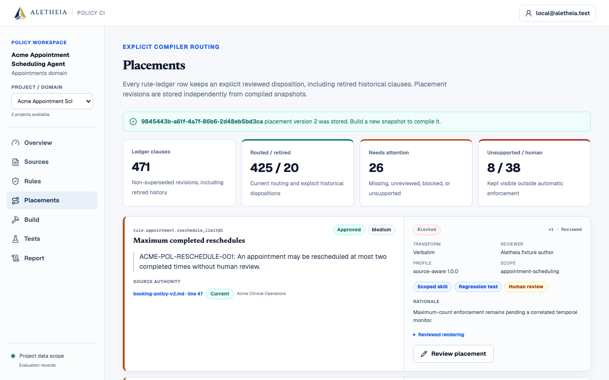
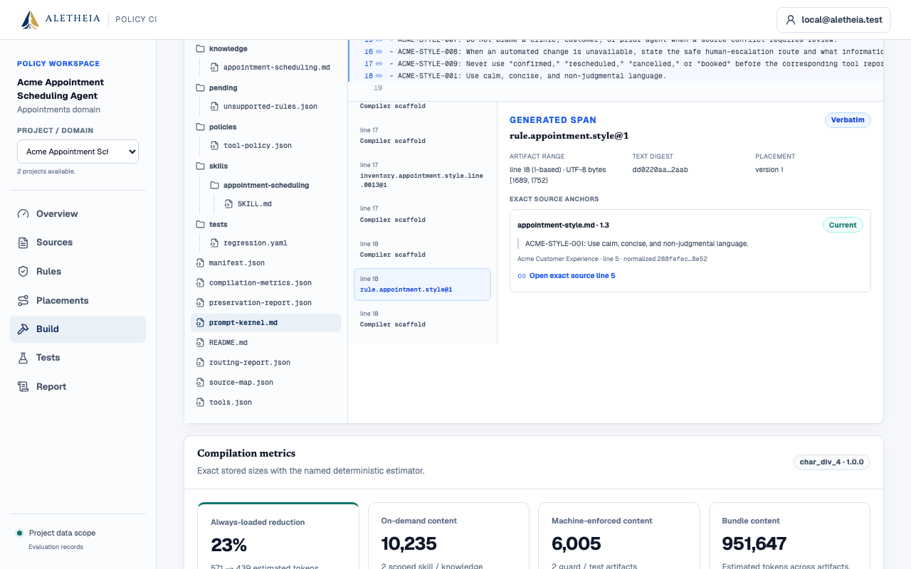

# Gate 1 — Source-aware policy refactoring and prompt/skill compilation

## Local verification report

**Verdict:** complete in the verified local two-domain deterministic fixture scope  
**Verification date:** 2026-08-04  
**Last independently audited anchor:** `4f4e410a2b114bb16b55566bca79c555a489bd9b`  
**Original Gate 1 start:** `91055f6043edfd7f0cb171eac0bd04c611f2d509`  
**Reconciliation starting HEAD:** `0d5b356e6143f784c726f55406ca1ba12d308af0`  
**Verified implementation commit:** `2292a5f7089d061c9dc8b977852ee04d182373bc`  
**Documentation checkpoint:** `4354479884ed142e028dc4ea18aaedb627ab33c3`  
**Deployment boundary:** not deployed; public Workers remain on `147448a`

## 1. What this verdict means

Gate 1 closes the local product checkpoint defined in the successor review and
handoff: one generic, profile-driven compiler now builds Northstar retail and
Acme appointments; exact source/placement/generated-span evidence is persisted
and inspectable; structural preservation/context metrics are explicit; the
review/build UI exposes the new contracts; and the complete local quality,
database, packaging, and browser checkpoint passes.

The verdict is deliberately narrow:

- it applies to deterministic synthetic fixtures, not customer documents;
- it applies to implementation commit `2292a5f7089d061c9dc8b977852ee04d182373bc`,
  not to base commit `91055f6` alone;
- the implementation commit contains code, fixtures, tests, and generated
  contracts; this successor report and refreshed screenshots are a separate
  documentation checkpoint;
- no Gate 1 bundle was promoted to Cloudflare, Render, or Supabase;
- Gate 0H anonymous hosted verification remains a separate in-progress track;
- behavioral fidelity remains `not_measured`.

The audited anchor moved before Gate 1 work began. The inspected
`4f4e410..91055f6` range contains the five guest-preview, waitlist, resilience,
HTTPS, brand, and release-evidence commits `3c352ee`, `85e6666`, `c8505c7`,
`147448a`, and `91055f6`; that newer work was retained rather than reset.

At original Gate 1 start `91055f6`, the tracked tree was clean and exactly three
historical research inputs were untracked. Before this reconciliation, local
`main` and `origin/main` both resolved to `0d5b356`. The intervening local work
was audited rather than reset. The same three historical inputs remain
untracked and byte-identical after implementation checkpoint `2292a5f`,
documentation checkpoint `4354479`, and the CI-evidence follow-up worktree.

Preserved untracked inputs at both boundaries:

- `aletheia_independent_review_and_product_decision (1).md` —
  `60b2cb7445f24965a485aadcbda54dfca15b38a971c418d7fe4a1a5c07ac6e53`;
- `aletheia_refined_codex_execution_handoff_v2 (1).md` —
  `325e6c980eeee5b11457e1ebe7475aef04d734962345fc84a83e81ba46c63948`;
- `aletheia_research_map_80_sources (1).md` —
  `206d2767343a31f24b3a6e7dcb02af3805c0dc205bcf25867788711fbc861ff4`.

## 2. Current capability matrix

Feature gates and production maturity are separate ladders:

| Capability/track | Evidence-backed status | Boundary |
|---|---|---|
| Gate 0 — Local deterministic foundation | Complete in the settled tested Northstar fixture/local scope | Source review, authority resolution, build, 16-case/three-arm run, trace, and report remain the regression floor. |
| Gate 0H — Hosted verification and release hardening | In progress / unverified | Permanent-user Northstar staging passed; anonymous Turnstile redemption and complete guest E2E remain unverified. Hosted schema is at `0005`. |
| Gate 1 — Source-aware policy refactoring and prompt/skill compilation | Complete in verified local two-domain fixture scope | Northstar and Acme API/database/frontend/packaging/browser evidence passed. Migration `0006` and Gate 1 are not deployed. |
| Gates 2–8 | Absent as product capabilities | Interfaces, research, and tau sync do not establish solver, temporal, mutation, model, live evaluation, tau execution, or runtime SDK operation. |
| Production maturity | Preview, not production-ready | Database RLS/private-schema isolation, signed promotion, customer ingestion/runtime, operational assurance, and enterprise controls remain absent. |

This matrix is the current capability view. The before/after Gate 1 matrix is
retained in the v3 execution handoff.

## 3. Ending-state map

The verified implementation commit adds or materially changes these Gate 1 areas:

| Area | Principal repository paths |
|---|---|
| Persistence and HTTP contracts | `apps/api/app/models.py`, `schemas.py`, `api/routes.py`, `tenancy.py`, migration `0006_gate1_compilation_contracts.py` |
| Generic compiler | `apps/api/app/services/compiler.py`, `apps/api/app/services/compilation/`, `fixture_inventory.py` |
| Domain packs | `data/demo/northstar-retail/`, `data/demo/acme-appointments/`, `appointment_seed.py` |
| Pinned profile | `data/compiler-profiles/source-aware-v1.json` |
| Generated contracts | `apps/api/openapi.json`, 34 JSON Schemas in `apps/api/schemas/`, generated TypeScript client schema |
| Reviewer UI | source/rule pages, project switcher, `routing/`, `placement-workbench.tsx` |
| Build evidence UI | `build-inspection.tsx`, `compilation-presentation.ts`, build workbench |
| Verification | Gate 1 compilation/persistence tests, web unit/component tests, six Playwright flows |

`git diff --check` passed. The three original untracked `(1).md` research files
remain byte-for-byte unchanged; their versioned successors record predecessor
names and SHA-256 values.

## 4. Checkpoint-equivalent change record

Gate 1 landed across the earlier `d10af27` implementation and focused
`2292a5f` reconciliation commit rather than as five separate PRs. The following
is an evidence-honest equivalent patch/status breakdown. The pass verdict
applies to the combined end state.

| Checkpoint | Files/areas changed and why | Verification boundary |
|---|---|---|
| A — truth reconciliation | Canonical docs/capabilities were reconciled from audited `4f4e410` through starting `91055f6`; historical prompts and the three untracked inputs were retained. | Commit/worktree lineage and hashes inspected; no newer guest/branding work reset. |
| B — Gate 0 local closure | Operation/project locking, declared-linkage naming, approved-rule provenance, raw/normalized hash docs, and generated-contract drift coverage were closed or reconfirmed. | Gate 0 backend/migration/web/browser regression remains green; hosted blockers stay separate. |
| C / slice 1 — contracts/profile | Models, schemas, API/tenancy, migration `0006`, pinned profile, OpenAPI, JSON Schemas, and generated client establish placement/span/report contracts. | Contract, migration, fail-closed, and cross-tenant tests pass. |
| D / slice 2 — generic compiler | `services/compilation/` splits profile, provenance, rendering, metrics, and bundle logic from the compatibility facade. | Northstar parity, no-domain-string, fresh-process reproducibility, digest, and old-build tests pass. |
| E / slice 3 — Acme | The long-form appointment domain pack, seed service, manual conflicts, placements, cases, and shared runner path establish a second domain. | Shared compile/run path passes; stale, ambiguous, and pending items remain explicit. |
| F / slice 4 — UI | Project switcher, source authority, placement routing, build inspection, exact source links, metrics, and state handling extend the existing design system. | 87 web tests and six Playwright flows pass. |
| G / slice 5 — evidence/docs | Successor documents, capability inventory, screenshots, build roots, provenance example, and claim boundary record the checkpoint. | Packaging/audits and CI `30967934453` pass on `4354479`; no Gate 2 or hosted Gate 1 claim. |

## 5. Implemented source-to-artifact chain

```text
raw source bytes + normalized text
  → document authority metadata
  → exact source anchor
      quote + line range + UTF-8 byte range
      raw/normalized/quote hashes + parser/normalizer identity
  → versioned rule provenance
      source_anchored
      OR reviewer_authored_guidance with reviewer/rationale/reviewed_at
  → append-only placement version
  → pinned compiler profile/configuration
  → generated artifact span
  → routing/preservation/metrics/source-map/manifest evidence
  → artifact SHA-256
  → build root
```

The compiler recognizes `prompt_kernel`, `skill`, `knowledge`,
`pre_tool_policy`, `test`, `human_review`, and `unsupported` destinations.
Transforms are explicitly classified. Reviewer-authored guidance carries no
source-anchor claim. Test-generated span markers and other generated framing are
`compiler_scaffold`, never source-derived text.

## 6. Final verification results

| Check | Final result |
|---|---|
| Default API suite | **148 passed, 1 skipped** |
| Focused regenerated-contract/Gate 1 suite | **40 passed** |
| Python lint/types | Ruff passed; mypy passed over 38 source files |
| SQLite schema | Alembic upgrade and drift check passed through `0006` |
| Fresh PostgreSQL migration marker | **1 passed, 4 deselected**; temporary database removed |
| Frontend unit/component | ESLint passed; strict typecheck passed; **87/87** Vitest tests across 23 files passed |
| Next.js | Production build passed; dynamic `/projects/[projectId]/routing` emitted |
| Focused browser path | Two-domain E2E **1/1** in 34.6 seconds including fresh server startup |
| Complete browser path | Playwright **6/6** in 1.1 minutes using fresh isolated API/web ports and Next output |
| Cloudflare bundle | OpenNext passed at compatibility date `2026-08-04` |
| Wrangler | Version `4.118.0` type generation, root/staging deploy dry-runs, and startup check passed |
| Dry-run package observation | 53 assets; 8,026.44 KiB / 1,666.83 KiB gzip |
| Local startup observation | Active startup 40.4 ms in a 174.9 ms local profile window |
| Dependency audits | `pip-audit` and production `pnpm audit --audit-level high`: no known vulnerabilities reported |
| GitHub Actions | [Run 30967934453](https://github.com/amanda-yin-x/aletheia/actions/runs/30967934453) passed quality, PostgreSQL integration, and secret scanning on documentation checkpoint `4354479` containing implementation checkpoint `2292a5f`. |
| Patch hygiene | `git diff --check` passed |

### Exact local command ledger

These are the commands associated with the recorded results. The PostgreSQL
database name was disposable and was dropped after its marker passed.

```bash
cd apps/api
uv run ruff check app tests
uv run mypy app
ENVIRONMENT=test uv run pytest -q
ENVIRONMENT=test uv run pytest -q \
  tests/test_contracts.py \
  tests/test_gate1_compilation.py \
  tests/test_gate1_persistence_contracts.py

cd ../..
make migration-check

cd apps/api
TEST_DATABASE_URL=postgresql+asyncpg://amandayin@localhost:5432/aletheia_gate1_verify_20260804_2130 \
TEST_MIGRATION_DATABASE_URL=postgresql+psycopg://amandayin@localhost:5432/aletheia_gate1_verify_20260804_2130 \
ENVIRONMENT=test \
uv run pytest -q -m postgres tests/test_migrations_integration.py

ENVIRONMENT=test uv run python scripts/export_contracts.py
cd ../..
corepack pnpm --filter @aletheia/web exec openapi-typescript \
  ../../apps/api/openapi.json \
  -o ../../packages/api-client/src/schema.d.ts
git diff --exit-code -- \
  apps/api/openapi.json apps/api/schemas packages/api-client/src/schema.d.ts

corepack pnpm --filter @aletheia/web lint
corepack pnpm --filter @aletheia/web run cf-typegen
corepack pnpm --filter @aletheia/web typecheck
corepack pnpm --filter @aletheia/web test
corepack pnpm --filter @aletheia/web build
corepack pnpm --filter @aletheia/web exec opennextjs-cloudflare build
corepack pnpm --filter @aletheia/web exec wrangler deploy --dry-run --env=""
corepack pnpm --filter @aletheia/web exec wrangler deploy --dry-run --env staging
corepack pnpm --filter @aletheia/web exec wrangler deploy --dry-run --env="" \
  --outfile .open-next/worker.bundle
corepack pnpm --filter @aletheia/web exec wrangler check startup \
  --worker .open-next/worker.bundle

PLAYWRIGHT_API_PORT=18081 \
PLAYWRIGHT_WEB_PORT=13031 \
PLAYWRIGHT_ISOLATED_WEB=1 \
corepack pnpm --filter @aletheia/web exec playwright test \
  --grep "two domains keep project routing and compiled evidence isolated"

cd apps/api && uv run pip-audit
cd ../.. && corepack pnpm audit --prod --audit-level high
git diff --check
```

The complete final browser command was:

```bash
PLAYWRIGHT_API_PORT=8014 \
PLAYWRIGHT_WEB_PORT=3014 \
PLAYWRIGHT_ISOLATED_WEB=1 \
corepack pnpm --filter @aletheia/web test:e2e
```

An earlier full run hit a transient Next development 404 only when stale reused
Next output was present. The clean isolated run passed without a product
workaround. This is why the final 6/6 result, not the earlier intermediate run,
is the accepted browser evidence.

The dry-run size and startup values are packaging observations. They do not
measure production latency, capacity, availability, or a deployed Gate 1
Worker. Dependency audits are not an independent security assessment.

## 7. Two-domain proof

The same compiler version/profile and generic modules build both packs. A
regression scans generic compiler code for Northstar/refund/Acme/appointment
semantic branches. Separate-process Northstar and Acme builds produce
byte-identical artifact bytes, manifest bytes, and digests for identical pinned
inputs.

### Northstar retail

- Preserves the current-versus-legacy refund authority workflow.
- Retains the deterministic 16-case, three-arm release scenario.
- Exercises source review, placement, build, guarded mutation behavior, traces,
  and evidence exports.

### Acme appointments

- Uses a substantial source `SKILL.md`, current booking policy, stale SOP,
  baseline prompt, style/knowledge references, strict tools, and synthetic state.
- Exercises verified identity, trusted IANA timezone, weekday customer-local
  `[09:00, 17:00)`, and exact confirmation before cancellation or a fee-bearing
  change.
- Runs 10 deterministic cases through the shared runner; the enforced arm has
  zero executed violations in the fixture assertion.
- Keeps cooldown and reschedule-limit clauses blocked pending a correlated
  temporal monitor; undefined “daylight hours” is unsupported.

The full browser suite verifies project switching in both directions, Acme
placements/build/routing/preservation/source-map inspection, and return to
isolated Northstar evidence.

### Browser evidence

The placement screenshot shows the post-review non-superseded rule ledger. Its
471 rows and 20 retired rows are the current-revision view described above, not
the complete 473-clause compiler disposition ledger. The build screenshot is a
post-review demonstration build and is not presented as having the clean
fixture root recorded in Section 9.





## 8. Artifact tree

Both verified builds contain 20 artifacts. The Acme build demonstrates the
generic shape:

```text
README.md
manifest.json
prompt-kernel.md
compilation-metrics.json
preservation-report.json
routing-report.json
source-map.json
tools.json
facts/
  evaluation.json
inputs/
  clause-inventory.json
  compiler-profile.json
  findings.json
  pinned-source-metadata.json
  placement-decisions.json
  rules.json
knowledge/
  appointment-scheduling.md
skills/
  appointment-scheduling/
    SKILL.md
policies/
  tool-policy.json
tests/
  regression.yaml
pending/
  unsupported-rules.json
```

The manifest pins the concrete artifact names and digests for a build. This
tree is a representative verified build, not a promise that every future
profile must emit the same scoped filenames.

## 9. Verified build roots and representative metrics

| Measure | Northstar retail | Acme appointments |
|---|---:|---:|
| Build root | `0b11b2f92430cabaa09bbf3eb837431a3f66b4c79a535003a4512f07698d5676` | `fb8eb7030c76211e0247481dd637aa52a241385379f4867ceb41d51a9343d2a4` |
| Artifact count | 20 | 20 |
| Declared normative lines | 172 | 473 |
| Persisted generated spans | 709 | 1,798 |
| Baseline always-loaded | 165 lines / 6,794 chars / 1,699 est. tokens | 40 / 2,284 / 571 |
| Compiled kernel | 16 / 1,077 / 270 | 18 / 1,753 / 439 |
| Expected task context | 186 / 10,277 / 2,570 | 449 / 42,690 / 10,673 |
| Scoped skill | 163 / 9,009 / 2,253 | 414 / 39,524 / 9,881 |
| Scoped knowledge | 7 / 191 / 48 | 17 / 1,413 / 354 |
| Guard | 7,884 chars / 1,971 est. tokens | 5,893 / 1,474 |
| Regression tests | 943 lines / 24,602 chars / 6,151 est. tokens | 583 / 18,121 / 4,531 |
| Total without manifest | 1,155 lines / 1,407,209 chars / 351,803 est. tokens | 1,058 / 3,806,026 / 951,507 |

The deterministic estimator is `char_div_4` version `1.0.0` (an explicit
character-count estimate, not a model tokenizer). These values separate
always-loaded/task context from total generated evidence; total bundle size is
not presented as runtime prompt size.

Northstar's 172-entry compiler disposition ledger contains 161 routed, two
unsupported, and nine retired clauses; 163 are active normative clauses.
Acme's 473-entry compiler disposition ledger contains 425 routed, 18 blocked,
eight unsupported, and 22 retired clauses; 451 are active. The reviewer UI
shows 471 non-superseded Acme rule revisions (425 routed, 20 retired, and 26
needing attention); the two superseded rule revisions remain in immutable
history and account for the difference from the complete compiler ledger.
Explicit-disposition, routing, verified-anchor, approved
preservation, severity-weighted preservation, and supported machine-decidable
high/critical guard-and-test ratios are `1.0` for both builds. Northstar records
two unresolved active clauses; Acme records 24. `behavioral_fidelity` remains
`not_measured`.

## 10. Representative exact provenance

One final Acme generated span resolves as follows:

```text
policies/tool-policy.json
  generated line 1
  generated UTF-8 bytes [2966, 4323)
    → rule.appointment.identity@1
    → placement version 1
    → booking-policy-v2.md@1
      source line 12
      source UTF-8 bytes [401, 513)
      exact quote:
        ACME-POL-IDENTITY-001: Verify the customer's identity before
        rescheduling or cancelling an existing appointment.
      source-anchor id
        c1bb12a022f4ceb7ee0bf67910e4790db1f479da7dcbe5cd5ea2a1b7bddcf424
      quote SHA-256
        988582ab18665e359a8d38a5e9ef7cebc8ba35667c47b33f85b8c57baa8e4502
      original + normalized SHA-256
        084118ce55a164764fab6705bf6158e805864f93589e3227ddfe609d81d924f2
      parser/normalizer
        checked_in_utf8@1.0.0 / aletheia_text@1.0.0
  artifact SHA-256
    bfd10a2ac984ed5c5289b8fa43044af6a29d7b57e62d8b45ebd8fd41a8906226
  → manifest non-root member set
  → Acme build root
    fb8eb7030c76211e0247481dd637aa52a241385379f4867ceb41d51a9343d2a4
```

Tests independently slice the stored normalized UTF-8 bytes at every anchor,
decode them, compare the exact quote, recompute the quote hash, and match raw
and normalized document hashes. Generated spans are persisted and their count
matches the source-map span count.

## 11. Demo path

1. Run `make bootstrap`, then `make demo`; open `http://localhost:3000`.
2. Enter the seeded workspace and use **Project / domain** to select Acme.
3. In **Sources**, compare the current policy and superseded SOP, inspect owner,
   status/effective scope, both hashes, and exact line links.
4. In **Rules**, review conflict witness context, authority, exact sources, and
   the winner/loser consequence.
5. In **Placements**, inspect every non-superseded rule, current placement
   version, destinations, transform, disposition, reviewer/rationale, and
   missing/blocked/unsupported/human-review states. Concurrent updates use
   `expected_version` and an explicit `409` refresh path.
6. In **Build**, compile and inspect the full artifact tree, exact hashes and
   downloads, generated spans, routing, preservation, and context metrics.
7. Follow a source-derived span back to its exact source line; contrast it with
   reviewer-authored no-source-anchor attribution and compiler scaffold.
8. Confirm “Behavioral fidelity: Not measured.”
9. Run the Acme deterministic cases, then switch to Northstar and confirm the
   refund artifacts/evidence remain project-isolated.

## 12. Claims this evidence supports

- A reviewed clause can be given one explicit, versioned disposition.
- The same bounded compiler operates over two materially different synthetic
  domains without fixture semantics in generic compiler modules.
- Generated rule-derived text can be traced to exact verified source bytes and
  a placement version.
- Reviewer-authored guidance is attributable without pretending it is quoted
  source text.
- Stale, blocked, unsupported, and unresolved material remains explicitly
  visible instead of silently entering active artifacts.
- A covered deterministic proposal can be stopped before fixture mutation.
- Local builds and their evidence can be reproduced and inspected.

## 13. Claims this evidence does not support

- automatic extraction or understanding of arbitrary customer documents;
- automatic/general conflict discovery or formal verification;
- semantic equivalence or behavioral fidelity after refactoring;
- live-model quality, cost, latency, or reliability improvement;
- a live scheduling/refund integration or customer runtime SDK;
- upstream tau benchmark execution or a benchmark score;
- policy mutation scoring or generic temporal monitors;
- hosted Gate 1 operation, anonymous guest verification, or production SLOs;
- database RLS, secure customer uploads, signed promotion, enterprise controls,
  compliance, certification, or independent security assurance.

## 14. Exact next gate

The immediate next step is a product/evidence checkpoint, not automatic scope
expansion:

1. retain `2292a5f7089d061c9dc8b977852ee04d182373bc` as the exact local
   implementation checkpoint and deploy it only as a separate, verified release;
2. keep Gate 0H anonymous hosted verification separate and do not infer it from
   local Gate 1;
3. treat a stable customer-facing `aletheia check` exit/evidence contract and a
   narrow pre-side-effect dispatcher as the immediate post-Gate-1 integration
   checkpoint if product validation calls for them; the existing
   `compile`/`test`/`report` CLI was retained, but no full Gate 8 command or
   customer runtime is claimed;
4. gather design-partner evidence on whether authority/placement/source-map
   review saves real policy-engineering time;
5. only with explicit approval begin **Gate 2: bounded deterministic analysis**
   over the existing typed IR, with SAT/UNSAT/unknown/timeout and declared
   assumptions.

Temporal monitors, mutation testing, local/live models, upstream tau execution,
runtime SDKs, signed distribution, and enterprise control planes remain Gates
3–8 or later production work. They are not hidden parts of this Gate 1 verdict.
